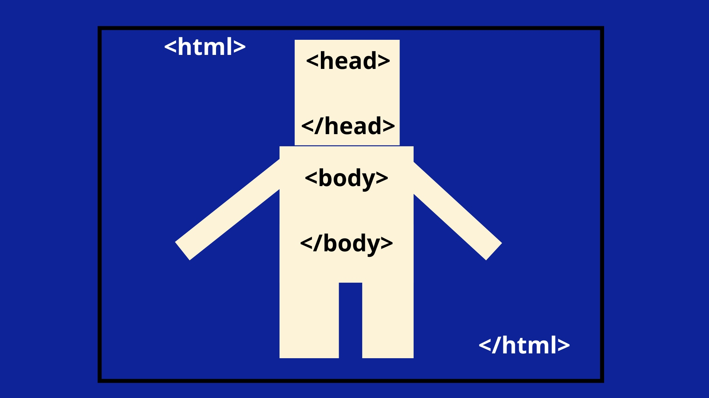
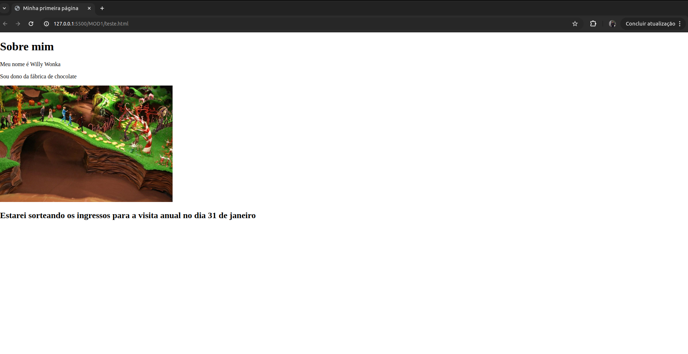
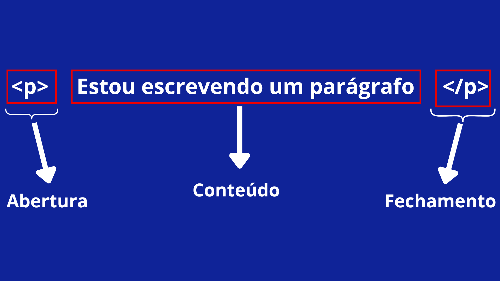
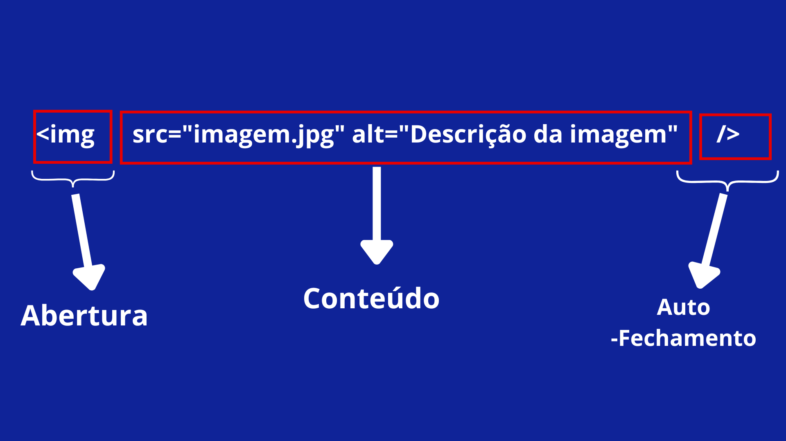

<h1> Introdução Ao HTML</h1>
<div align='center'> 
    
</div>

HTML (Linguagem de marcação de HiperTexto) é o código que vocÊ usa para estruturar uma página web e seu conteúdo. Por exemplo, o conteúdo pode ser estruturado em parágrafos, em uma lista com marcadores ou usando imagens e tabelas.

Diferente do que alguns entendem no ínicio do mundo da programação, HTML **NÃO é** uma **linguagem de programação**; É uma linguagem de marcação usada para definir a estrutura do conteúdo. Ao utilizar a linguagem de marcação, montamos o esqueleto da página a partir de elementos.

<h2>Estrutura de uma página</h2>

De uma forma visual e mais simplificada, um documento HTML tem essa estrutura:

<div align='center'> 
    
</div>

Encarregada da estruturação e, posteriormente, a renderização, construimos esse documento a partir de `tags`.

Abaixo, mostraremos um exemplo:

```HTML
<!DOCTYPE html>
<html lang="pt-br">
  <head>
    <meta charset="UTF-8" />
    <meta name="viewport" content="width=device-width, initial-scale=1.0" />
    <title>Minha primeira página</title>
  </head>
  <body>
    <h1>Sobre mim</h1>
    <p>Meu nome é Willy Wonka</p>
    <p>Sou dono da fábrica de chocolate</p>
    
    <h2>Estarei sorteando os ingressos para a visita anual no dia 31 de janeiro</h2>
</body>
</html>
```

> Muita calma nessa hora, não priemos cânico. Já iremos entender o que cada linhazinha estranha faz

O código acima acaba gerando:

<div align='center'> 
    
</div>

Não é como os lindos sites que encontramos ao navegar na internet, mas saiba que todos eles possuem um esqueleto assim. Essa é a base para futuros designs e páginas web magnificas.

<h3>tags</h3>

Vimos, no código acima, linhas estranhas com alguns simbolos diferentes. Bom, aquilo são as **tags**.

No decorrer do curso e na carreira de vocês, vão ver que existem tags que sao especificas para cada situação, exemplo: Tags para definição de estrutura, para imagens, titulos, subtitulos, tabelas, parágrafos e até mesmo tags para modificar esses parágrafos, colocando as letras em _itálico_ e em **negrito**.

As tags HTML geralmente vêm em pares: **uma tag de abertura e uma tag de fechamento**. A tag de abertura inicia o elemento e a tag de fechamento encerra o elemento. Mas é importante entender que algumas tags são auto-fechadas.

<h6> Exemplo de uma tag em pares: </h6>

```HTML
<p> Estou escrevendo um parágrafo </p>
```

<div align='center'> 
    
</div>

<h6> Exemplo de uma tag auto-fechada: </h6>

```HTML

```

<div align='center'> 
    
</div>

---

Agora que já vimos um pouco da manipulação das tags, vamos entender melhor as tags principais.

> Atenção: Essas tags já foram vistas no primeiro exemplo deste documento

<h5>Tags Estruturais</h5>

<h6> < html > </h6>
Define esse documento como um documento HTML

```HTML
<!DOCTYPE html>
      <html lang="pt-BR">
        ...
      </html>
```

<h6> < head > </h6>
Contém os metadados e links para arquivos externos como o CSS e Javascript

```HTML
<head>
  <meta charset="UTF-8">
  <title>Meu Primeiro Site</title>
</head>

```

<h6> < body > </h6>
É aqui onde iremos definir todo o conteúdo visível da página

```HTML
<body>
    <h1>Sobre mim</h1>
    <p>Meu nome é Willy Wonka</p>
    <p>Sou dono da fábrica de chocolate</p>
    
    <h2>Estarei sorteando os ingressos para a visita anual no dia 31 de janeiro</h2>
</body>

```

O trabalho com essas tags é fundamental para criar as páginas bem estruturadas e funcionais. Cada tag possui um propósito específico e entender como usá-las corretamente é crucial para um desenvolvimento web eficiente. Esepramos que essa pequena explicação ajude a entender melhor a estrutura básica do HTML.

<h4>Link auxiliar:</h4>

- [Web docs HTML]("https://developer.mozilla.org/pt-BR/docs/Web/HTML)
