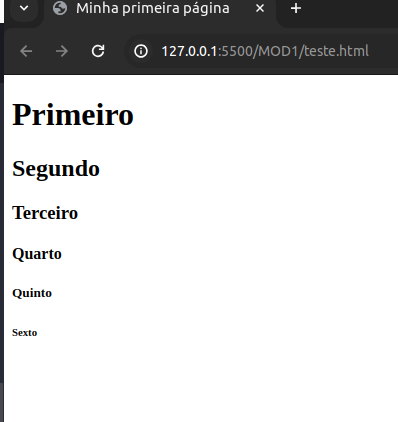
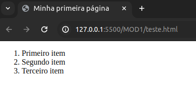
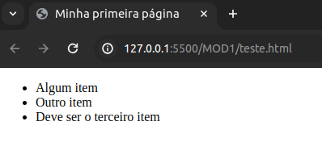
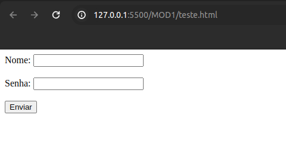

<h1>Conhecendo mais tags do HTML</h1>

Depois de entender a estrutura inicial do HTML, vamos ver mais tags existentes ?

Para definir a estrutura conhecemos `<html>`,`<head>` e `<body>`. Agora iremos dar prioridade as tags que irão definir a nossa página. As tags colocadas dentro da tag `<body>`

<h5>Textos</h5>

Um dos principais objetivos do HTML é dar estrutura de texto e significado, também conhecido como semântica), para que um navegador possa exibi-lo corretamente. Este artigo explica a forma como HTML pode ser usado para estruturar uma página de texto, adicionar títulos e parágrafos, enfatizar palavras, criar listas e muito mais.

Os textos bem estruturados são compostos por titulos e parágrafos para tornar os conteúdos mais fáceis e agradáveis de ler.

<h6>Parágrafos</h6>
Para cada parágrafo temos de envolver um conteúdo dentro de uma tag `<p>`, dessa forma:

```HTML
<p> Parabéns, esse foi seu primeiro parágrafo </p>
```

<h6>Títulos</h6>
Já os titulos possuem 6 tags. Cada uma delas representa um nível diferente de conteúdo. `<h1>` representa o título principal, `<h2>` representa subtítulo, `<h3>` representa sub-subtítulos, e assim por diante.

```HTML
  <body>
    <h1>Primeiro</h1>
    <h2>Segundo</h2>
    <h3>Terceiro</h3>
    <h4>Quarto</h4>
    <h5>Quinto</h5>
    <h6>Sexto</h6>
</body>
```

<h6>Saída:</h6>
<div> 
    
</div>

<h6>Listas</h6>

Chegou a hora de conhecer as listas, e para isso temos duas opções: **Listas ordenadas** para listas onde a ordem importa e **Listas não ordenadas** para listas onde a ordem dos itens não importam

Listas ordenadas são definidas como `<ol>`

```HTML
  <body>
    <ol>
      <li>Primeiro item</li>
      <li>Segundo item</li>
      <li>Terceiro item</li>
    </ol>
</body>
```

<h6>Saída:</h6>

<div>
    
</div>

já as listas **NÃO** ordenadas são definidas como `<ul>`

<h6>Saída:</h6>
<div>
    
</div>

As duas listas possui outra tag dentro delas. A tag `<li>` determinam as **linhas da sua lista**

<h5>Links</h5>
A tag de link HTML é responsável que faz a ligação entre um documento e outro, sendo ele da mesma página ou de uma página de outro domínio. Esse elemento garantiu que o HTML se destacasse, e moldou a internet da forma que ela é hoje! Portanto, é o principal fundamento que forma a web.

Para realizar um link, podemos chamar as tags <a></a> com o atributo href. Por exemplo, caso você queira criar um link no seu texto que redirecione à página inicial do Vai na Web:

```HTML
<p><a href="https://vainaweb.com.br/">clique aqui.</a> para acessar o site do Vai na Web</p>
```

<h5>Multimidia</h5>
Para incluir imagens, vídeos, áudios, iframes e outros tipos de conteúdo multimídia temos a opção entre 3 tags

- `` para inserção de imagens
  
  ```HTML
    
  ```

- `<video>` para colocar vídeos

  ```HTML
    <video controls>
      <source src="video.mp4" type="video/mp4">
     <source src="video.ogg" type="video/ogg">
     Seu navegador não possui suporte para Vídeos.
    </video>
  ```

- `<iframe>` para incorporar elementos de outra página a sua página web
 
 ```HTML
    <iframe src="https://www.homehost.com.br">
      <p>Seu navegador não possui suporte para iFrames.</p>
   </iframe>
  ```

<h5>Formulários</h5>

São tags muito importantes que manipulam os formulários criados na página web.

A tag `<form>` é usada para definir um formulário HTML. Todos os elementos de formulário devem estar contidos dentro desta tag.

Dentro do forms temos a tag `<input>` que é usada para criar vários tipos de campos de entrada, como texto, senhas, botões, etc. O tipo de campo é definido pelo atributo type.

- `type`
  - **text**: Campo de texto de linha única.
  - **password**: Campo de senha que oculta a entrada.
  - **submit**: Botão para enviar o formulário.
  - **radio**: Botão de opção (seleção única).
  - **checkbox**: Caixa de seleção (seleção múltipla).

- `<label>`
  A tag `<label>` define um rótulo para um elemento `<input>`, melhorando a usabilidade e acessibilidade do formulário. O atributo for deve corresponder ao id do elemento de entrada.


```HTML
<form action="/submit_form" method="post">
  <label for="name">Nome:</label>
  <input type="text" id="name" name="name"><br><br>
  
  <label for="password">Senha:</label>
  <input type="password" id="password" name="password"><br><br>
  
  <input type="submit" value="Enviar">
</form>

```

<h6>Saída: </h6>

<div align='center'>
  
</div>

--- 
<h3>Visão geral das Tags</h3>

Abaixo temos uma tabela que dá uma visão geral de algumas tags que são utilizadas no desenvolvimento web. 

| Tag                     | Função                                                                            |
|-------------------------|-----------------------------------------------------------------------------------|
| `<!DOCTYPE>`            | Declara o tipo de documento e versão do HTML                                      |
| `<a>`                   | Define uma âncora ou link                                                         |
| `<abbr>`                | Define uma abreviação ou acrônimo                                                 |
| `<address>`             | Define informações de contato                                                     |
| `<area>`                | Define uma área dentro de um mapa de imagem                                       |
| `<article>`             | Define um conteúdo independente                                                   |
| `<aside>`               | Define conteúdo lateral ou complementar                                           |
| `<audio>`               | Define conteúdo de som ou música                                                  |
| `<b>`                   | Define texto em negrito                                                           |
| `<base>`                | Define a URL base para todos os links relativos no documento                      |
| `<bdi>`                 | Isola uma parte do texto que pode ser formatada em uma direção diferente          |
| `<bdo>`                 | Substitui a direção de texto padrão                                               |
| `<blockquote>`          | Define uma seção que é citada de outra fonte                                      |
| `<body>`                | Define o corpo do documento HTML                                                  |
| `<br>`                  | Insere uma quebra de linha                                                        |
| `<button>`              | Define um botão clicável                                                          |
| `<canvas>`              | Define uma área gráfica para desenhar gráficos                                    |
| `<caption>`             | Define uma legenda para uma tabela                                                |
| `<cite>`                | Define o título de uma obra                                                       |
| `<code>`                | Define um trecho de código de programação                                         |
| `<col>`                 | Define propriedades de coluna para elementos `<colgroup>`                         |
| `<colgroup>`            | Define um grupo de uma ou mais colunas em uma tabela                              |
| `<data>`                | Vincula um valor de máquina a um conteúdo de texto                                |
| `<datalist>`            | Define uma lista de opções predefinidas para um campo de entrada                  |
| `<dd>`                  | Define uma descrição ou valor em uma lista de definição                           |
| `<del>`                 | Define texto que foi removido de um documento                                     |
| `<details>`             | Define detalhes adicionais que o usuário pode ver ou esconder                     |
| `<dfn>`                 | Define um termo que está sendo definido                                           |
| `<dialog>`              | Define um diálogo ou janela                                                       |
| `<div>`                 | Define uma divisão ou seção no documento HTML                                     |
| `<dl>`                  | Define uma lista de definição                                                     |
| `<dt>`                  | Define um termo em uma lista de definição                                         |
| `<em>`                  | Define texto enfatizado                                                           |
| `<embed>`               | Define um contêiner para uma aplicação externa ou conteúdo interativo (plugin)    |
| `<fieldset>`            | Agrupa elementos relacionados em um formulário                                    |
| `<figcaption>`          | Define uma legenda para um elemento `<figure>`                                    |
| `<figure>`              | Especifica conteúdo independente, como ilustrações                                |
| `<footer>`              | Define o rodapé de uma seção ou documento                                         |
| `<form>`                | Define um formulário HTML para entrada do usuário                                 |
| `<h1>` a `<h6>`         | Define cabeçalhos HTML de nível 1 a 6                                             |
| `<head>`                | Define a seção de cabeçalho do documento                                          |
| `<header>`              | Define o cabeçalho de uma seção ou documento                                      |
| `<hgroup>`              | Agrupa um conjunto de `<h1>` a `<h6>` para um cabeçalho                           |
| `<hr>`                  | Define uma mudança temática no conteúdo                                           |
| `<html>`                | Define o documento HTML                                                           |
| `<i>`                   | Define texto em itálico                                                           |
| `<iframe>`              | Define um iframe                                                                  |
| ``                 | Define uma imagem                                                                 |
| `<input>`               | Define um campo de entrada                                                        |
| `<ins>`                 | Define texto que foi inserido em um documento                                     |
| `<kbd>`                 | Define entrada de teclado                                                         |
| `<label>`               | Define um rótulo para um elemento `<input>`                                       |
| `<legend>`              | Define uma legenda para um elemento `<fieldset>`                                  |
| `<li>`                  | Define um item em uma lista                                                       |
| `<link>`                | Define a relação entre um documento e um recurso externo                         |
| `<main>`                | Define o conteúdo principal do documento                                          |
| `<map>`                 | Define um mapa de imagem                                                          |
| `<mark>`                | Define texto marcado ou destacado                                                 |
| `<meta>`                | Define metadados sobre o documento                                                |
| `<meter>`               | Define uma medida escalar dentro de um intervalo conhecido                       |
| `<nav>`                 | Define links de navegação                                                         |
| `<noscript>`            | Define conteúdo alternativo para usuários que não suportam scripts                |
| `<object>`              | Define um contêiner para um recurso externo                                        |
| `<ol>`                  | Define uma lista ordenada                                                         |
| `<optgroup>`            | Agrupa opções dentro de uma lista suspensa                                        |
| `<option>`              | Define uma opção em uma lista suspensa                                            |
| `<output>`              | Representa o resultado de um cálculo                                              |
| `<p>`                   | Define um parágrafo                                                               |
| `<param>`               | Define um parâmetro para um objeto                                                |
| `<picture>`             | Define um contêiner para múltiplas fontes de imagem                               |
| `<pre>`                 | Define texto pré-formatado                                                        |
| `<progress>`            | Representa o progresso de uma tarefa                                              |
| `<q>`                   | Define uma citação curta                                                          |
| `<rp>`                  | Define o que mostrar para navegadores que não suportam ruby                       |
| `<rt>`                  | Define uma explicação/pronúncia de caracteres (ruby)                              |
| `<ruby>`                | Define uma anotação ruby                                                          |
| `<s>`                   | Define texto que não é mais correto                                               |
| `<samp>`                | Define uma saída de amostra de um programa de computador                          |
| `<script>`              | Define um script a ser executado                                                  |
| `<section>`             | Define uma seção no documento                                                     |
| `<select>`              | Define uma lista suspensa                                                         |
| `<small>`               | Define texto menor                                                                |
| `<source>`              | Define múltiplas fontes para elementos de mídia (`<video>` e `<audio>`)           |
| `<span>`                | Define uma seção no documento                                                     |
| `<strong>`              | Define texto importante                                                           |
| `<style>`               | Define informações de estilo para um documento                                    |
| `<sub>`                 | Define texto subscrito                                                            |
| `<summary>`             | Define um resumo para o elemento `<details>`                                      |
| `<sup>`                 | Define texto sobrescrito                                                          |
| `<table>`               | Define uma tabela                                                                 |
| `<tbody>`               | Agrupa o conteúdo do corpo de uma tabela                                          |
| `<td>`                  | Define uma célula em uma tabela                                                   |
| `<template>`            | Define um template reutilizável                                                   |
| `<textarea>`            | Define uma área de texto multilinha                                               |
| `<tfoot>`               | Agrupa o conteúdo do rodapé de uma tabela                                         |
| `<th>`                  | Define uma célula de cabeçalho em uma tabela                                      |
| `<thead>`               | Agrupa o conteúdo do cabeçalho de uma tabela                                      |
| `<time>`                | Define uma data/hora                                                              |
| `<title>`               | Define o título do documento                                                      |
| `<tr>`                  | Define uma linha em uma tabela                                                    |
| `<track>`               | Define faixas de texto para elementos `<video>` e `<audio>`                       |
| `<u>`                   | Define texto sublinhado                                                           |
| `<ul>`                  | Define uma lista não ordenada                                                     |
| `<var>`                 | Define uma variável                                                               |
| `<video>`               | Define um vídeo                                                                   |
| `<wbr>`                 | Define uma oportunidade de quebra de linha                                        |
