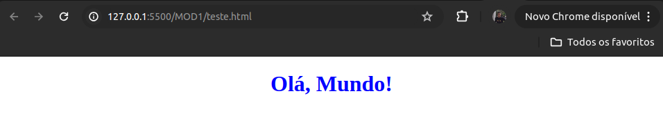
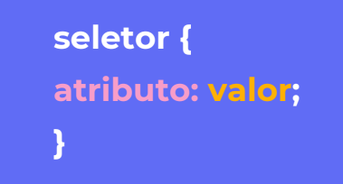
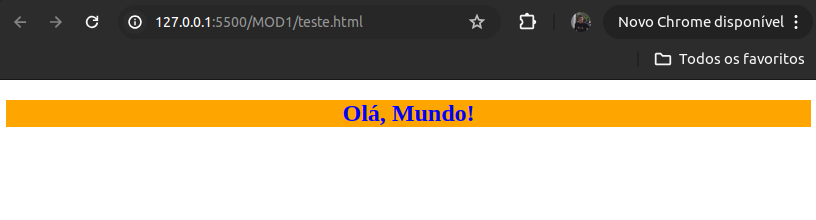

<h1>Introdução ao CSS</h1>

Agora que ja aprendemos sobre o HTML e a estruturar o esqueleto das nossas páginas, chegou a hora do CSS (Cascading Stylesheets), no português, **Folhas de Estilo em Cascata**

É a linguagem responsável por estilizar as nossas páginas web. A partir daqui iremos definir cores, tamanhos, estilização de botões, formulários, do estilo da página no geral. 

<h3>Como usar</h3>

O CSS pode ser aplicado de três maneiras principais:

- **CSS em Linha (Inline CSS)**: Adiciona estilos diretamente no elemento HTML usando o atributo style.

```HTML
<!DOCTYPE html>
<html>
    <head>
        <title>Exemplo de Inline CSS</title>
    </head>
    <body>
        <h1 style="color: blue; text-align: center;">Olá, Mundo!</h1>
    </body>
</html>
```

- **CSS Interno (Internal CSS)**: Define estilos dentro da tag `<style>` no cabeçalho de um documento HTML.

```HTML
<!DOCTYPE html>
<html>
<head>
    <title>Exemplo de Internal CSS</title>
    <style>
        h1 {
            color: blue;
            text-align: center;
        }
    </style>
</head>
<body>
    <h1>Olá, Mundo!</h1>
</body>
</html>
```
- **CSS Externo (External CSS)**: Vincula um arquivo CSS externo ao documento HTML usando a tag <link>.

<h6>Documento HTML</h6>

```HTML
<!-- index.html -->
<!DOCTYPE html>
<html>
<head>
    <title>Exemplo de External CSS</title>
    <!-- Linha que conecta os documentos-->
    <link rel="stylesheet" type="text/css" href="styles.css"> 
</head>
<body>
    <h1>Olá, Mundo!</h1>
</body>
</html>

```

<h6>Documento CSS</h6>

```CSS
/* styles.css */
h1 {
    color: blue;
    text-align: center;
}
```

<h6>Esses 3 exemplos produzem:</h6>



>A forma mais comum e recomendada é importar a folha de estilos, ou seja, utilizar o CSS externo

<h3>Sintaxe</h3>

O documento CSS consiste de vários
seletores que descrevem quais
elementos e como eles serão
modificados. Começamos descrevendo
qual elemento queremos modificar,
dentro do seletor temos o que
chamamos de propriedades e seus
respectivos valores

<div align='center'>
       
</div>

```CSS
/* styles.css */
h1 {
    color: blue;
    text-align: center;
}
```

- **h1**: É o elemento selecionado
- **color** e **text-align**: são atributos do CSS
- **blue** e **center**: são valores de estilização dados aos atributos 


<h3>Principais seletores:</h3>

Temos tipos de seletores comuns para poder estilizar o elemento. Cada um com sua devida importância e funcionalidade

- **Seletor de elemento**: Estiliza todos os elementos de um determinado tipo.

```CSS
h1 {
    color: blue;
}
```
Dessa maneira, todos os elementos com a tag `<h1>` terão a cor **azul**

- **Seletores de Classe**: Estiliza todos os elementos que possuem uma determinada classe. As classes são definidas com um ponto (.).Muito útil para as classes que se
repetem ao longo da página.


<h6>Documento HTML</h6>

```HTML
<!-- index.html -->
<!DOCTYPE html>
<html>
<head>
    <title>Saudacao</title>
    <!-- Linha que conecta os documentos-->
    <link rel="stylesheet" type="text/css" href="styles.css"> 
</head>
<body>
    <section classname='primeira-sessao'>
        <h1>Olá, Mundo!</h1>
    </section>
</body>
</html>

```

<h6>Documento CSS</h6>

```CSS
/* styles.css */
h1 {
    color: blue;
    text-align: center;
}

.primeira-sessao{
    background-color: orange
}
```

- **Seletores de ID**: Estiliza o elemento único que possui um determinado ID. Os IDs são definidos com um sustenido (#). É
legal de ser usado em elementos que **não se repetem na página.**


<h6>Documento HTML</h6>

```HTML
<!-- index.html -->
<!DOCTYPE html>
<html>
<head>
    <title>Saudacao</title>
    <!-- Linha que conecta os documentos-->
    <link rel="stylesheet" type="text/css" href="styles.css"> 
</head>
<body>
    <section id='primeira-sessao'>
        <h1>Olá, Mundo!</h1>
    </section>
</body>
</html>

```

<h6>Documento CSS</h6>

```CSS
/* styles.css */
h1 {
    color: blue;
    text-align: center;
}

#primeira-sessao{
    background-color: orange
}
```

<h6>Resultado dos seletores de classe e de id:</h6>

<div align='center'>
       
</div>

<h3>Entendendo a cascata:</h3>
Dependendo da posição em que o CSS esteja sendo
chamado na página o código tem uma certa prioridade
na hora de ser exibido pelo navegador. Como nas
pedras da cachoeira, a água flui melhor em alguns
lugares do que em outros. Esse é um conceito que vai
ser muito importante futuramente.
O navegador lê nossa página de cima para baixo, no
exemplo a seguir, ambos elementos estão sendo
selecionados usando mesmo tipo de seletor, nesse caso
as classes, mas a propriedade do bloco de baixo
consegue sobrescrever a de cima.

```CSS
.paragrafo {
    background-color: red
}
.paragrafo {
    background-color: grey
}
```

O elemento que possui a classe paragrafo terá a cor de fundo cinza (grey).


<h3>Código de exemplo:</h3>

<p>
 <a link='https://codesandbox.io/p/sandbox/fragrant-violet-foc0oo?file=%2Findex.html'>Clique aqui</a> para ser redirecionado a um código de exemplo na plataforma  <b>CodeSandBox</b>.
</p>


