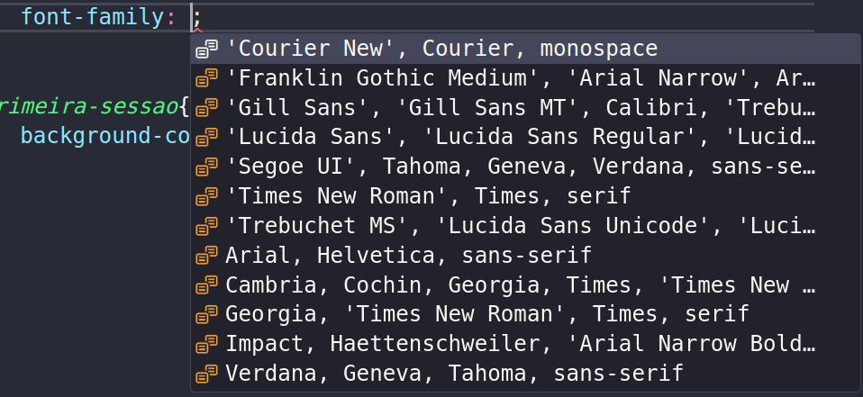
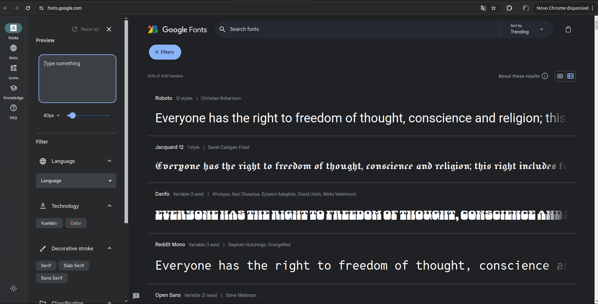
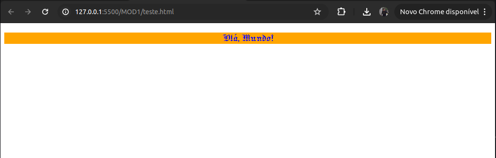

<h1>Cores e tipografia</h1>

Chegou o momento de aprendermos a colorir a nossa página. No CSS, as cores podem ser definidas de várias formas: nomes de cores, valores hexadecimais, RGB e RGBA. Iremos ver exemplos para aplicar na nossa folha de estilo.

<h3>Nomes de Cores</h3>

O CSS reconhece um conjunto de nomes de cores que podem ser usados diretamente. Alguns exemplos incluem:

```CSS
color: red;
color: blue;
color: green;
```

<h3>Valores Hexadecimais</h3>

Os valores hexadecimais representam cores em formato **#RRGGBB**, onde **RR**, **GG** e **BB** são valores **hexadecimais** (de 00 a FF) que definem a intensidade do vermelho, verde e azul, respectivamente

```CSS
color: #ff0000; /* Vermelho */
color: #0000ff; /* Azul */
color: #008000; /* Verde */

```

<h3>RGB e RGBA</h3>

Monitores são pretos e iluminados por
vários pontinhos de luz. Vamos
somando pontinhos vermelhos, verdes, e azuis até chegar na cor. A cor RGB É
formada por três pares de números, vermelho, verde e azul, formados por três dígitos. Quanto mais alto o número mais clara é a cor.
Já o RGBA insere a propriedade **alpha**, essa que controla a **opacidade** da cor, deixando ela mais transparente ou mais opaca. Esse quarto número vai de 0.1 até 0.9. **Quanto maior o numero, mais forte fica**

```CSS
     /*rgb(Red, Green, Blue)*/
color: rgb(255, 0, 0); /* Vermelho */

     /*rgba(Red, Green, Blue, Alpha)*/
color: rgba(0, 0, 255, 0.5); /* Azul com 50% de opacidade */
```

<h2>Propriedades de cores</h2>

| Propriedade       | Descrição                                             | Sintaxe                               |
|-------------------|-------------------------------------------------------|---------------------------------------|
| `color`           | Define a cor do texto.                                | `color: <cor>;`                       |
| `background-color`| Define a cor de fundo de um elemento.                 | `background-color: <cor>;`            |
| `border-color`    | Define a cor da borda de um elemento.                 | `border-color: <cor>;`                |
| `outline-color`   | Define a cor da borda de destaque (outline).          | `outline-color: <cor>;`               |
| `text-decoration-color`| Define a cor da decoração do texto (sub/risca). | `text-decoration-color: <cor>;`       |
| `caret-color`     | Define a cor do cursor de texto (caret).              | `caret-color: <cor>;`                 |
| `column-rule-color`| Define a cor da linha entre colunas em layout multi-coluna. | `column-rule-color: <cor>;`  |
| `fill`            | Define a cor de preenchimento para gráficos SVG.      | `fill: <cor>;`                        |
| `stroke`          | Define a cor do contorno para gráficos SVG.           | `stroke: <cor>;`                      |
| `stop-color`      | Define a cor das paradas em gradientes SVG.           | `stop-color: <cor>;`                  |

> Na coluna sintaxe, `<cor>` deve ser preenchida com uma das três formas vistos acima, Hexadecimal, Nome das cores, RGB ou RGBA

---

<h1>Tipografia</h1>

A tipografia é um dos elementos fundamentais do design de uma página web, afetando a legibilidade e a estética do conteúdo. O CSS oferece diversas propriedades para controlar e personalizar a tipografia. Abaixo, exploraremos as formas de aplicar estilos tipográficos, como importar novas fontes, e como usar as principais propriedades tipográficas.

<h3>Fontes Padrão</h3>
Você pode definir a fonte de texto usando a propriedade font-family. É comum fornecer uma lista de fontes, que inclui fontes específicas e fontes genéricas, para garantir que o texto seja renderizado corretamente caso a primeira fonte não esteja disponível.

```CSS
body {
    font-family: 'Arial', 'Helvetica', sans-serif;
}
```

<div >
    
</div>

>Sugestão de Fontes que o próprio CSS faz


<h3>Importando novas Fontes</h3>

Há também a possibilidade que estão disponíveis no sistema. Iremos importar fontes da web. Para isso, iremos até o [Google Fonts](https://fonts.google.com/) (fonte mais popular para esse propósito).

<div>
    
</div>

>Aqui teremos MUITAS fontes disponíveis 

Para pegar a fonte desejada é só clicar nela e pegar o código fonte


https://github.com/Samuel-prata/materiaisComplementaresFront-end/assets/103957897/1758fe9b-69fa-4aed-8e4c-d373f65583bb


Após isso, adicionamos o link ao documento html

```HTML
 <head>
    <meta charset="UTF-8" />
    <meta name="viewport" content="width=device-width, initial-scale=1.0" />
    <link rel="preconnect" href="https://fonts.googleapis.com">
    <link rel="preconnect" href="https://fonts.gstatic.com" crossorigin>
    <link href="https://fonts.googleapis.com/css2?family=Jacquard+12&display=swap" rel="stylesheet">
    <title>Minha primeira página</title>
  </head>
```

Testar no documento CSS

```CSS
h1 {
    color: blue;
    text-align: center;
    font-family: "Jacquard 12", system-ui;
    font-weight: 400;
    font-style: normal;
}
```
<h6>Produzindo a saída:</h6>

<div>
    
</div>

---

<h3>Propriedades de Tipografia</h3>

| Propriedade          | Descrição                                                        | Sintaxe                                  |
|----------------------|------------------------------------------------------------------|------------------------------------------|
| `font-family`        | Define a família de fontes para o texto.                        | `font-family: <família>;`                |
| `font-size`          | Define o tamanho da fonte do texto.                             | `font-size: <tamanho>;`                  |
| `font-weight`        | Define a espessura (peso) da fonte.                             | `font-weight: <peso>;`                   |
| `font-style`         | Define o estilo da fonte (normal, itálico, oblíquo).            | `font-style: <estilo>;`                  |
| `font-variant`       | Define variantes de fontes, como pequenas maiúsculas.           | `font-variant: <variante>;`              |
| `font-size-adjust`   | Ajusta o tamanho da fonte em função da altura x da fonte.       | `font-size-adjust: <valor>;`             |
| `font-stretch`       | Define a largura da fonte, como condensada ou expandida.        | `font-stretch: <valor>;`                 |
| `line-height`        | Define a altura da linha, influenciando o espaçamento vertical. | `line-height: <altura>;`                 |
| `letter-spacing`     | Define o espaçamento entre caracteres.                          | `letter-spacing: <espaçamento>;`         |
| `word-spacing`       | Define o espaçamento entre palavras.                            | `word-spacing: <espaçamento>;`           |
| `text-align`         | Define o alinhamento horizontal do texto.                       | `text-align: <alinhamento>;`             |
| `text-transform`     | Define a transformação do texto, como maiúsculas ou minúsculas. | `text-transform: <transformação>;`       |
| `text-indent`        | Define a indentação da primeira linha de um bloco de texto.     | `text-indent: <indentação>;`             |
| `text-shadow`        | Define sombra ao redor do texto.                                | `text-shadow: <sombra>;`                 |
| `white-space`        | Define como o espaço em branco é tratado no texto.              | `white-space: <valor>;`                  |
| `direction`          | Define a direção do texto (ltr ou rtl).                         | `direction: <direção>;`                  |
| `unicode-bidi`       | Define como o texto embutido em scripts bidirecionais é tratado.| `unicode-bidi: <valor>;`                 |

### Exemplos de Valores

- `<família>`: `'Arial', sans-serif`, `'Times New Roman', serif`
- `<tamanho>`: `16px`, `1em`, `100%`
- `<peso>`: `normal`, `bold`, `100`, `200`, ..., `900`
- `<estilo>`: `normal`, `italic`, `oblique`
- `<variante>`: `normal`, `small-caps`
- `<valor>`: numérico ou palavras-chave como `none`, `condensed`, `expanded`
- `<altura>`: `normal`, `1.5`, `150%`
- `<espaçamento>`: `normal`, `0.1em`, `1px`
- `<alinhamento>`: `left`, `right`, `center`, `justify`
- `<transformação>`: `none`, `capitalize`, `uppercase`, `lowercase`
- `<indentação>`: `50px`, `5%`
- `<sombra>`: `2px 2px 2px #000`
- `<direção>`: `ltr` (left-to-right), `rtl` (right-to-left)
- `<valor>`: `normal`, `pre`, `nowrap`, `pre-wrap`, `pre-line`
