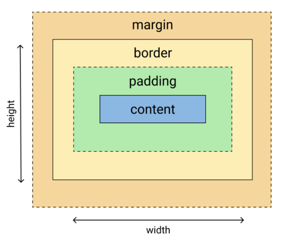

<h1>Display</h1>

O atributo display define o comportamento do elemento em relação aos demais elementos. Suas tipologias.
Entendendo a diferenças da propriedade display é crucial para a estruturação e telas responsivas. Com o valor correto, vocês podem controlar o fluxo dos elementos ajustando a visibilidade e criando algumas grades

<h3>Sintaxe</h3>

```CSS
display: <valor>
```
O valores que podem ser aplicados são

| Valor       | Descrição                                                                                         |
|-------------|---------------------------------------------------------------------------------------------------|
| `block`     | O elemento é renderizado como um bloco. Ocupa toda a largura disponível e começa em uma nova linha. |
| `inline`    | O elemento é renderizado como parte do fluxo de texto, sem quebra de linha antes ou depois.       |
| `inline-block` | O elemento é renderizado como um elemento inline, mas pode ter largura e altura definidas.       |
| `none`      | O elemento não é renderizado, não ocupa espaço no layout.                                          |
| `flex`      | Define um contêiner flexível, permitindo o uso do modelo de layout flexível.                       |
| `inline-flex` | Define um contêiner flexível em um contexto inline.                                                |
| `grid`      | Define um contêiner de grade, permitindo o uso do modelo de layout de grade.                       |
| `inline-grid` | Define um contêiner de grade em um contexto inline.                                                |
| `table`     | O elemento é renderizado como um bloco de tabela.                                                  |
| `inline-table` | O elemento é renderizado como uma tabela, mas como um elemento inline.                           |
| `table-row` | Define uma linha de tabela.                                                                        |
| `table-cell` | Define uma célula de tabela.                                                                       |
| `table-column` | Define uma coluna de tabela.                                                                     |
| `table-row-group` | Define um grupo de linhas de tabela (como `<tbody>`).                                          |
| `table-header-group` | Define um grupo de cabeçalhos de tabela (como `<thead>`).                                  |
| `table-footer-group` | Define um grupo de rodapés de tabela (como `<tfoot>`).                                      |
| `table-caption` | Define uma legenda de tabela.                                                                  |
| `list-item` | O elemento é renderizado como um item de lista.                                                    |
| `initial`   | Define o valor da propriedade para seu valor inicial padrão.                                       |
| `inherit`   | Herda o valor da propriedade de seu elemento pai.                                                  |

<h3>Diferenças</h3>

Apesar de alguns exemplos mostrados, iremos mostrar um pouco da diferença dos valores comumente vistos.

<h4>display: block</h4>

Quando um elemento tem a propriedade `display: block`, ele é renderizado como um **bloco**. Isso significa que o elemento ocupa toda a **largura** disponível de seu contêiner pai e força uma quebra de linha antes e depois dele. Os elementos de bloco são utilizados para criar a estrutura de layout de uma página.

<h4>display: none</h4>

Quando esse valor é aplicado, o elemento não é renderizado. É uma ótima alternativa para trabalhar com responsividade (tema que será abordado posteriormente). 

<h4>display: inline</h4>

Quando um elemento tem a propriedade display: inline, ele é renderizado dentro do fluxo de texto, sem quebras de linha antes ou depois dele. Elementos inline ocupam apenas o espaço necessário para seu conteúdo e permitem que outros elementos continuem na mesma linha.

<h4>display: flex</h4>

Criação de um container flexível, permite criar layouts flexíveis e responsivos. O elementos dentro do container podem ser posicionados e redimensionados


<h3>Block vs Inline</h3>

#### `display: block` vs `display: inline;` 

Como as caixas se comportam em relação as outras caixas
Comportamento externo das caixas

#### Display Block
- Ocupa toda a linha, colocando o próximo elemento abaixo desse
- width e height são respeitados
- padding, margin, border irão funcionar normalmente

<br>

#### Display Inline
- Os elementos ficam ao lado do outro e não empurram outros elementos para
baixo
- width e height não funcionam
- Somente valores horizontais de margin

<h1>Box-Model</h1>

O Box Model é fundamental para fazer layouts para web porque ele vai te dar maior facilidade na hora de aplicar o CSS. Ao entender os conceitos do Box 
Model muitas questões do CSS começam a fazer sentido. 

### O que é o Box Model? 
- Cada elemento é representado como uma caixa retangular 
- Essa caixa possui propriedades de uma caixa em 2 dimensões (largura x altura) 
### Propriedades da caixa 
- Tamanho (largura x altura) → **width** | **height** 
- Conteúdo → **content** 
- Bordas → **border** 
- Preenchimento interno → **padding** 
- Espaços fora da caixa → **margin** 

<div align='center'>
    
</div>

Inspecionando o quadrado no browser vamos ver que ele tem na verdade *180px de largura* e *180px de altura* mas foi especificado 150px por 150px, por que isso acontece? 

O nosso browser calcula os espaços dos elementos de uma maneira um pouco diferente do que imaginamos, quando nós adicionamos um padding de 15px estamos criando um espaço desse tamanho em todos os lados do elemento **(acima, abaixo, esquerda, direita).** O navegador então vai adicionar ao tamanho final esses espaços internos, somando o espaço interno da esquerda e da direita com a largura temos: 

**150 + 15 + 15 = 180px** 

O mesmo acontece com a altura que é acrescentada ao espaço de cima e de baixo:

**150 + 15 + 15 = 180px**

Esse comportamento não é tão evidente e acaba confundindo os desenvolvedores com muita frequência, vamos aprender a modificar esse comportamento padrão do nosso navegador! 

#### Margin 

Margin, é o espaço (margem) entre os elementos. 
Podemos dividir o margin em 4 valores: 

`margin-top | margin-right | margin-bottom | margin-left`

`values:  <length>  |  <percentage>  | auto`

Geralmente usamos uma forma abreviada **(shorthand)** para escrever o margin. Esse formato segue o sentido horário iniciando pelo **top** , seguindo para  **right** ,  **bottom**  e  **left** . 
```css

margin: 12px 16px 10px 4px; /* TOP = 12px | RIGHT = 16px | BOTTOM = 10px | LEFT = 4px */ 
margin: 12px 16px 0; /* TOP = 12px | RIGHT = 16px | BOTTOM = 0px | LEFT = 16px */ margin: 8px 16px; /* TOP = 8px | RIGHT = 16px | BOTTOM = 8px | LEFT = 16px */ 
margin: 8px; /* TOP = 8px | RIGHT = 8px | BOTTOM = 8px | LEFT = 8px */ 
```
O margin é aplicado em elementos com **display block**. Cuidado com o *margin collapsing* que é quando o top se junta ao bottom 

#### Padding 
O  padding  é o preenchimento interno da caixa. 
A propriedade padding pode ser escrita como nos formatos apresentados abaixo: 
`padding-top | padding-right | padding-bottom | padding-left`
 
Geralmente usamos uma forma abreviada **(shorthand)** para escrever o padding. Esse formato segue o **sentido horário** iniciando pelo  **top** , seguindo para  **right** ,  **bottom**  e  **left** . 

```CSS
padding: 12px 16px 10px 4px; /* TOP = 12px | RIGHT = 16px | BOTTOM = 10px | LEFT = 4px */ 
padding: 12px 16px 0; /* TOP = 12px | RIGHT = 16px | BOTTOM = 0px | LEFT = 16px */ padding: 8px 16px; /* TOP = 8px | RIGHT = 16px | BOTTOM = 8px | LEFT = 16px */ 
padding: 8px; /* TOP = 8px | RIGHT = 8px | BOTTOM = 8px | LEFT = 8px */
``` 

O padding pode ter valores (values) de comprimento **(px, em, rem)** ou de porcentagem **(%)**. O padding poderá causar diferença na largura de um elemento 

#### Box Sizing 
Como vimos o navegador não define os tamanhos dos elementos de uma maneira muito conveniente, mas nós podemos sobscrever esse comportamento com uma propriedade chamada box-sizing, vamos colocar em prática:

```CSS
.box { 
box-sizing: border-box; 
width: 150px; 
height: 150px; 
margin: 15px; 
padding: 15px; 
border: 2px solid black; 
background-color: red; 
} 
```

> Com essa propriedade nova (box-sizing) o nosso navegador irá respeitar os tamanhos especificados nas propriedades *width e height*. Se inspecionarmos nosso quadrado novamente vamos perceber que agora ele será renderizado com exatos 150px por 150px 
