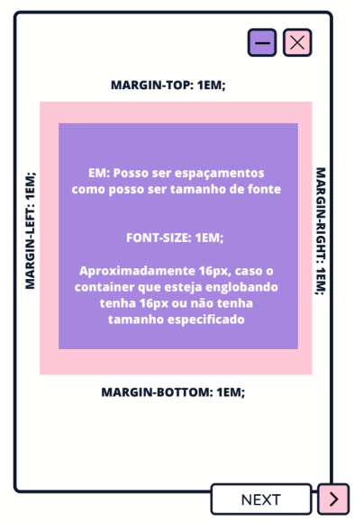
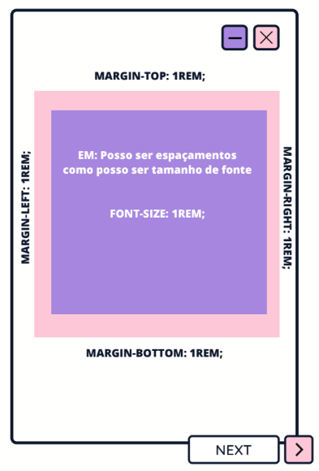
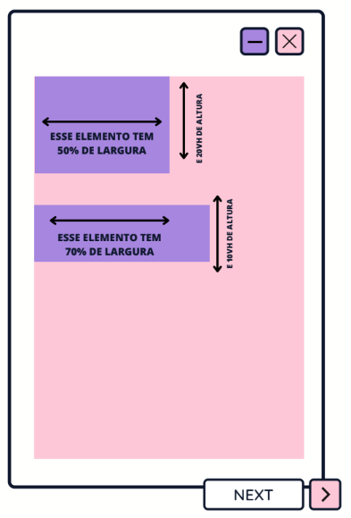

# Medidas

Como dar tamanho aos nossos elementos para especificar distâncias e proporções ?


### Tipos de Unidades de Medida

Dentre essas unidades de medida temos as:

- Unidades Absolutas
- Unidades Relativas

Entender como essas duas unidades funcionam é crucial para o desenvolvimento web.

### Unidades absolutas
As unidades absolutas têm tamanhos fixos que não dependem de outras propriedades. Elas são úteis quando você deseja um controle preciso sobre o tamanho de um elemento. Como unidades absolutas temos: 

- **px** (pixels): A unidade de medida mais comum. Um pixel é um ponto na tela
```CSS
.box {
    width: 200px;
    height: 100px;
}

```

- **in** (polegadas): Usadas principalmente para impressão
```CSS
.box {
   width: 2in;
}
```

- **cm** (Centimetros) e  mm (Milimetros): Também são usadas para impressão 

```CSS
.box {
    width: 5cm;
    height: 50mm;
}

```
- **pt** (pontos): Usada na tipografia tradicional, onde 1 pt é igual a 1/72 de polegada.
```CSS
.text {
    font-size: 12pt;
}

```
- **pc** (picas): Outra unidade tipográfica, onde 1 pc é igual a 12 pontos.
```CSS
.text {
    font-size: 1pc;
}
```

---
### Unidades Relativas

As unidades relativas são baseadas em outros valores, tornando-as ideais para layouts responsivos.

- **em**: Relativa ao tamanho da fonte do elemento pai. 1em é igual ao tamanho da fonte atual.

```CSS
.text {
    font-size: 2em; /* 2 vezes o tamanho da fonte do elemento pai */
}
```

<div align='center'>
    
</div>

- **rem** (root em): Relativa ao tamanho da fonte do elemento raiz (`<html>``).
```CSS
html {
    font-size: 16px;
}
.text {
    font-size: 2rem; /* 2 vezes o tamanho da fonte do elemento raiz (32px) */
}

```

<div align='center'>
    
</div>

 - **%** (percentual): Relativa ao tamanho do elemento pai.
```CSS
.container {
    width: 50%; /* 50% da largura do elemento pai */
}
```
<div align='center'>
    
</div>

- **vh** (viewport height) e **vw** (viewport width): Relativas ao tamanho da janela de visualização. 1vh é 1% da altura da viewport, e 1vw é 1% da largura da viewport.
```CSS
.full-screen {
    width: 100vw;
    height: 100vh;
}

```
<div align='center'>
    
</div>

- **vmin** e **vmax**: Relativas ao menor e ao maior valor entre a largura e a altura da viewport, respectivamente.
```CSS
.box {
    width: 50vmin; /* 50% do menor valor entre largura e altura da viewport */
}
```


### Conclusão
A compreensão desses aspectos torna mais fácil a criação de layouts responsíveis e bem estruturados. As unidades absolutas oferecem uma precisão maior, enquanto as unidades relativas permitem a adaptação do design em diferentes dispositivos e tamanhos de tela.
