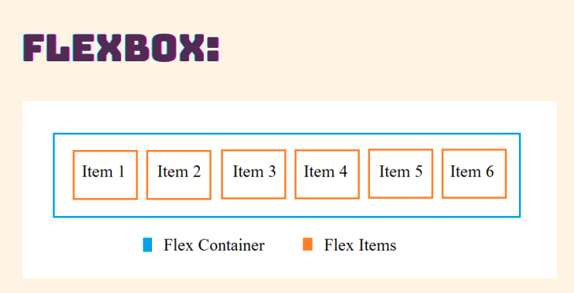
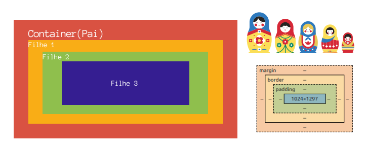
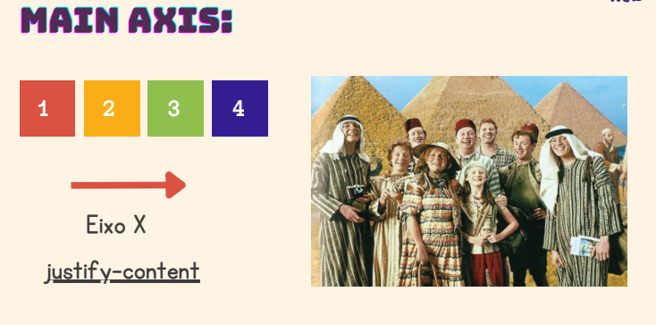
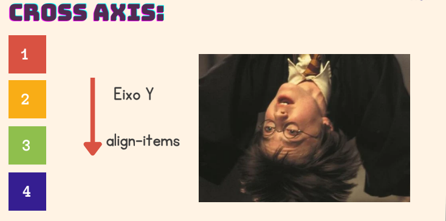
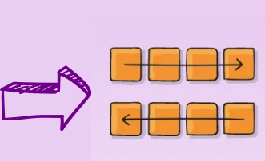
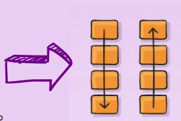
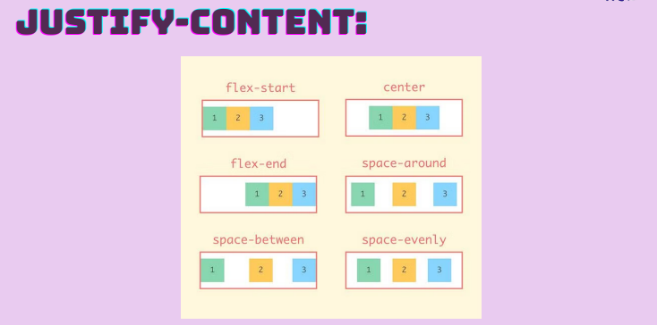
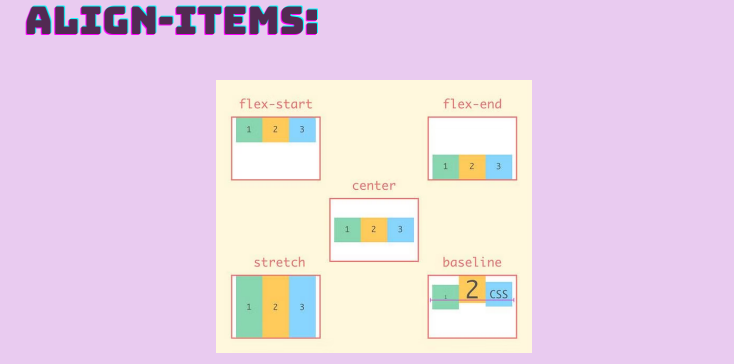
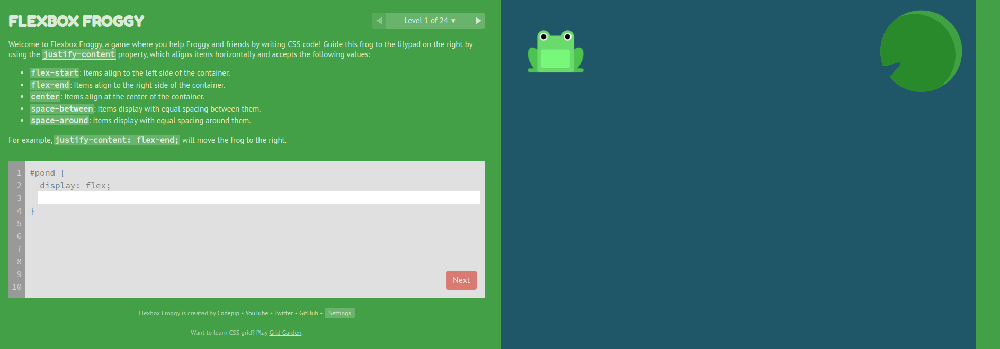
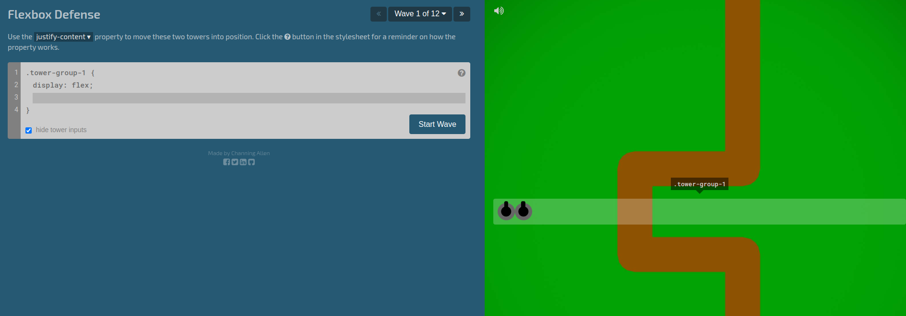

# Flexbox
Por muito tempo as ferramentas disponíveis para criar layouts e posicionar os elementos com boa compatibilidade entre browsers eram `float` e `position`. Todavia, essas ferramentas traziam muitas limitações, especialmente no quesito responsividade. Tarefas como centralização de uma div, posicionamento de um conteúdo interno (elementos pais e elementos filhos) ou tamanho distribuido igualmente entre colunas eram extremamente difíceis, beirando o impossível.

A ferramenta Flexbox foi criada para tornar essas tarefas mais simples e funcionais, tornando os elementos adaptáveis em diversas dimensões.

<div>
    
</div>

Flexbox é um módulo completo e não apenas uma única propriedade; Algumas delas devem ser declaradas no container **(Elemento-pai)** para que os itens sejam posicionados corretamente. Também irá existir casos onde teremos de declarar nos itens **(Elementos-filhos)**

<div>
    
</div>

---

### Eixos
Os *itens* serão dispostos no layout seguindo eixos, sendo eles: 

- #### Eixo Principal (Main axis)
  Também conhecido como o **Eixo X**

<div>
    
</div>

- #### Eixo Transversal (Cross Axis)
  Também conhecido como o **eixo Y**

<div>
    
</div>

---

### Como Utilizar ?
Para definir um contêiner flexível nós utilizamos a propriedade `display:flex`

``` html
    <div class="flexbox">
       <div class="primeira-div"></div>
       <div class="segunda-div"></div>
       <div class="terceiradiv"></div>
    </div>
```

```CSS
.flexbox{
    display:flex;
}
```

Após essa propriedade adicionado, iremos utilizar outras propriedades para definir o posicionamento dos nossos itens de acordo com os eixos

Começaremos abordando sobre a propriedade que direciona os itens dentro do contêiner. A propriedade `flex-direction`

Essa propriedade nos dá a capacidade de definir 4 valores

- **row** (**padrão**): Alinha os itens em uma linha, da esquerda para a direita.
- **row-reverse**: Alinha os itens em uma linha, da direita para a esquerda.

```CSS
.flexbox{
    display:flex;
    flex-direction: row | row-reverse;
}
```

<div align='center'>
    
</div>

---

- **column**: Alinha os itens em uma coluna, de cima para baixo.
- **column-reverse**: Alinha os itens em uma coluna, de baixo para cima.

```CSS
.flexbox{
    display:flex;
    flex-direction: column | column-reverse;
}
```

<div align='center'>
    
</div>

> Importante lembrar que para utilizar flex-direction, o contêiner deve estar com a propriedade display:flex

---

### Alinhando itens no Eixo Principal

Para alinharmos os itens no Main Axis (Eixo X), utilizamos a propriedade `justify-content`. Possui 6 maneiras diferentes de alinhar os conteúdos, sendo elas: 

- **flex-start (padrão):** Alinha os itens no início do contêiner.
- **flex-end**: Alinha os itens no final do contêiner.
- **center**: Centraliza os itens.

- **space-between**: Distribui o espaço uniformemente entre os itens.
- **space-around**: Distribui o espaço uniformemente ao redor dos itens.
- **space-evenly**: Distribui o espaço de de maneira igual
  
<div align='center'>
    
</div>

```CSS
.flexbox{
    display:flex;
    justify-content: flex-start | center | flex-end | space-around | space-between | space-evenly;
}
```

---

### Alinhando itens no Eixo Transversal
Para alinharmos os itens no Cross Axis (Eixo Y), utilizamos a propriedade `align-items`. Possui 5 maneiras diferentes de alinhar os conteúdos, sendo elas: 

- **stretch** **(padrão):** Estica os itens para preencher o contêiner.
- **flex-start**: Alinha os itens no início do eixo transversal.
- **flex-end**: Alinha os itens no final do eixo transversal.
- **center**: Centraliza os itens no eixo transversal.
- **baseline**: Alinha os itens ao longo de sua linha de base.

<div align='center'>
    
</div>

```CSS
.flexbox{
    display:flex;
    align-items: flex-start | center | flex-end | stretch | baseline;
}
```

### Prática:
Uma forma bem divertida de se praticar o flexbox é utilizando jogos. 

Deixaremos o link de dois sites onde vocês podem brincar a vontade para masterizar todas as suas habilidades com as propriedades

- [Flexbox Froggy](https://flexboxfroggy.com/)
  <div>
    
  </div>

- [Flexbox Defense](http://www.flexboxdefense.com/)
  <div>
    
  </div>