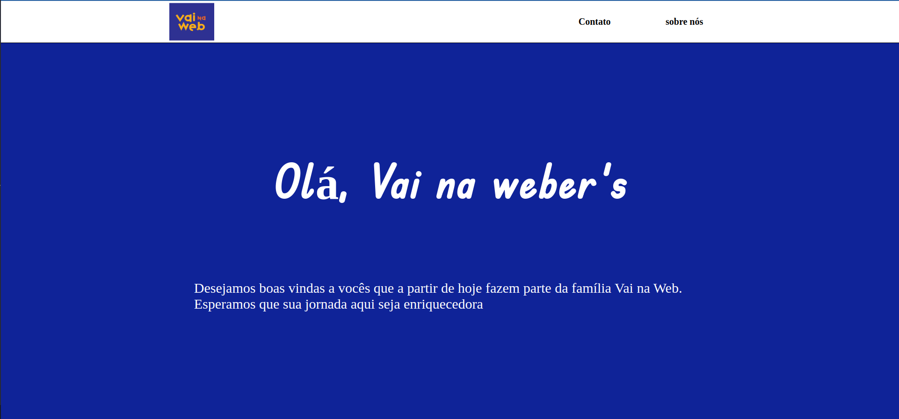
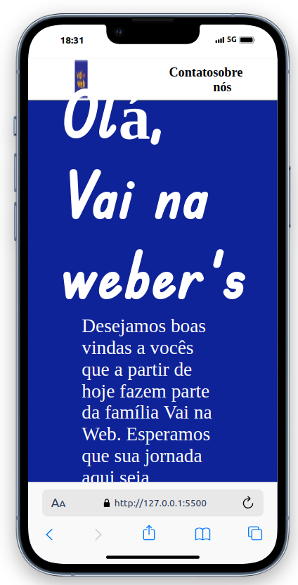
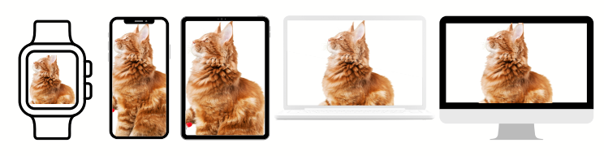
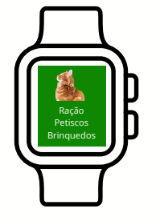
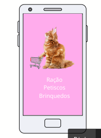
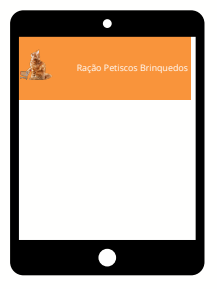
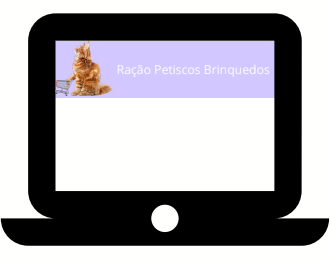
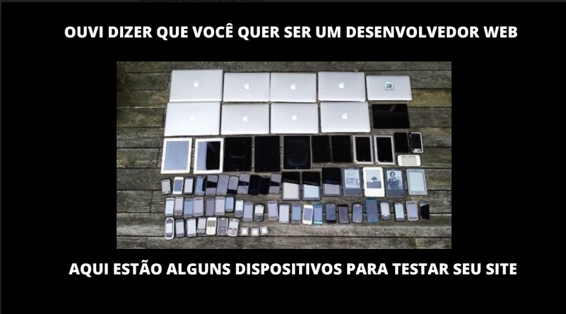

# Designs Responsivos

---

Imagine que depois de um trabalhão fazendo uma página de boas vindas no seu computador. Você resolve compartilhar esse projeto feito com alguem para celebrarem juntos pelo seu desenvolvimento.

<div>
    
</div>

porém, a pessoa resolve abrir o link no seu _Iphone 13 Pro_. O que ele irá encontrar:

<div align='center'>
    
</div>

> Na imagem acima utilizamos uma extensão do navegador. [Clique aqui](https://chromewebstore.google.com/detail/mobile-simulator-responsi/ckejmhbmlajgoklhgbapkiccekfoccmk?hl=pt-BR&utm_source=ext_sidebar) para pegar o link da extensão.

A responsividade é uma parte crucial na vida do Desenvolvedor. Suas aplicações podem ser abertas em diversos dispositivos e a nossa tarefa é permitir que ela seja bem construída em todos.

<div align='center'>
    
</div>

Para nos ajudar nessa tarefa, temos as **_medias querys_**

### @Media

Media query é uma ferramenta do css que tem como objetivo renderizar uma expressão (bloco) CSS de acordo com o tamanho de tela. Geralmente são usados as propriedades **min-width** (largura mínima) e **max-width** (largura-máxima). Sendo assim, se eu declarar duas medias no meu documento css, uma com o valor **max-width: 480px** e uma com o valor **max-width: 720px**, quando eu estiver uma tela de **ATÉ** 480px será redenrizado uma estilização limitada a essa largura de tela. E quando estiver numa tela **_maior de 480px_** e **_menor que 720px_**, será apresentado outra estilização adaptada para aquela tela.

As medias querys são nossas maiores aliadas na construção de sites responsivos, ou seja, que são adaptados a vários tamanhos de tela e dispositovos diferentes. Entendo que há diversos modos de se acessar um site nos dias atuais, desde o classico computador, até smarts tv.

Vamos utilizar uma header de gatos como exemplo:

## SmartWatch

<div style='display:flex; align-items:center; justify-content: space-evenly'>
    <div>
        
    </div>
    <div style='width:50%;'>
    Para trabalhar com SmartWatchs iremos utilizar o <b>max-width: 200px</b>. Quer dizer que uma tela que tenha ATÉ 200px de largura terá esse comportamento.
    </div>
</div>

```CSS
@media(max-width: 200px){
 comportamento aqui dentro das chaves. Ex:
    header{
        display: flex;
        flex-direction: column;
        background-color: green;
    }
}

```

---

## Mobile

<div style='display:flex; align-items:center; justify-content: space-evenly'>
    <div>
        
    </div>
    <div style='width:50%;'>
    Para trabalhar com Smartphones iremos utilizar o <b>(min-width: 201px) and (max-width: 500px)</b>. Quer dizer de uma tela que tenha 201px de largura até uma tela que tela 500px de largura vai ter esse comportamento
    </div>
</div>

```CSS
@media(min-width:201px) and (max-width: 500px){
 comportamento aqui dentro das chaves. Ex:
    header{
        display: flex;
        flex-direction: column;
        background-color: pink;
    }
}

```

---

## Tablet
<div style='display:flex; align-items:center; justify-content: space-evenly'>
    <div>
        
    </div>
    <div style='width:50%;'>
    Para trabalhar com tablets iremos utilizar o <b> (min-width:501px) and (max-width: 900px)</b>. "Quer dizer de uma tela que tenha 501px de largura até uma tela que tela 900px de largura vai ter esse comportamento"
    </div>
</div>

```CSS
@media(min-width:501px) and (max-width: 900px){
 comportamento aqui dentro das chaves. Ex:
    header{
        display: flex;
        flex-direction: column;
        height: 20vh;
        justify-content: space-between;
        align-items: center;
        background-color: orange;
    }
}

```

---

## Laptop
<div style='display:flex; align-items:center; justify-content: space-evenly'>
    <div>
        
    </div>
    <div style='width:50%;'>
    Para trabalhar com Laptops iremos utilizar o <b>(min-width: 901px) and (max-width: 1500px)</b>. Quer dizer de uma tela que tenha 901px de largura até uma tela que tela 1500px de largura vai ter esse comportamento
    </div>
</div>

```CSS
@media(min-width:901px) and (max-width: 1500px){
 comportamento aqui dentro das chaves. Ex:
    header{
        display: flex;
        flex-direction: column;
        height: 30vh;
        justify-content: space-between;
        align-items: center;
        background-color: violet;
    }
}

```

---

## Desktop
<div style='display:flex; align-items:center; justify-content: space-evenly'>
    <div>
        
    </div>
    <div style='width:50%;'>
    Para trabalhar com Desktop iremos utilizar o <b>(min-width: 1501px) and (max-width: 1800px)</b>. "Quer dizer de uma tela que tenha 1501px de largura até uma tela que tela 1800px de largura vai ter esse comportamento"
    </div>
</div>


```CSS
@media(min-width:1501px) and (max-width: 1800px){
 comportamento aqui dentro das chaves. Ex:
    header{
        display: flex;
        flex-direction: column;
        height: 50vh;
        justify-content: space-between;
        align-items: center;
        background-color: blue;
    }
}

```
---

## Wide Screen
<div style='display:flex; align-items:center; justify-content: space-evenly'>
    <div>
        
    </div>
    <div style='width:50%;'>
    Para trabalhar com telas grandes iremos utilizar o <b>(min-width: 1801px)</b>. Quer dizer de uma tela que seja maior que 1801px de largura vai ter esse comportamento
    </div>
</div>

```CSS
@media(max-width: 1801px){
 comportamento aqui dentro das chaves. Ex:
    header{
        display: flex;
        flex-direction: column;
        justify-content: space-between;
        align-items: center;
        background-color: red;
    }
}
```

---

<div>
    
</div>