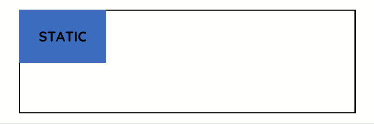
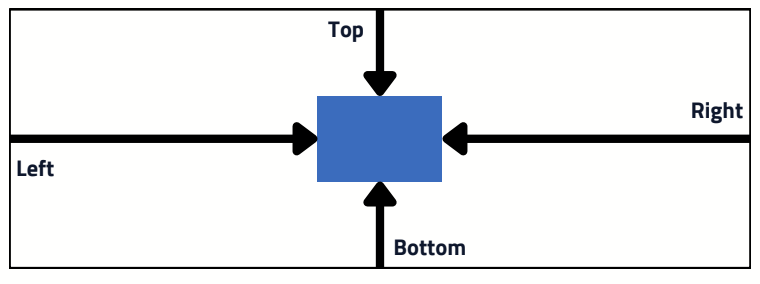
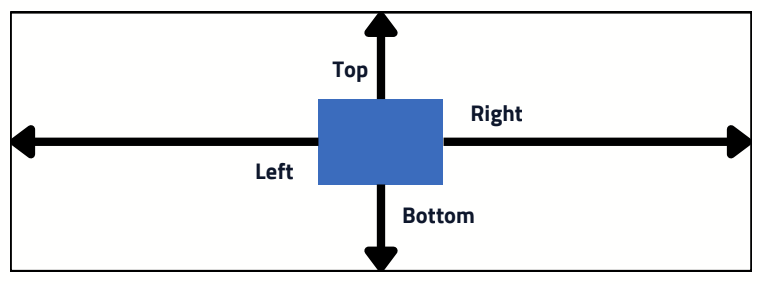
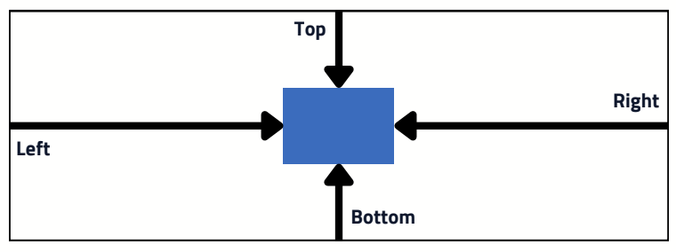

# Position


Quando estamos trabalhando no desenvolvimento web, surgem perguntas como "Como fixar um menu no topo?" ou "Como posicionar um elemento à esquerda de outro elemento?", entre outras. Para resolver essas questões, nos deparamos com a propriedade `position`.


> Position = Posição

O posicionamento padrão de todo elemento no HTML é estático, ou seja, tem seu valor como ```position: static```. s

>Quando vemos como padrão, significa que esse valor é atribuído mesmo que não tenha sído declarado

Todo o elemento estático é posicionado pelo canto superior esquerdo do documento. É a posição 0.

## Mas como eu altero ?

Para alterar o posicionamento de um elemento, é preciso utilizar outros valores na propriedade position. Podemos atribuir 5 valores a essa propriedade.

- static
- sticky
- absolute
- relative
- fixed

Com a alteração desses valores, podemos utilizar também outras propriedades auxiliares: **top, bottom, left e right**. Apenas o valor static que ignora esses valores auxiliares.


### Static

O `position: static` é o valor padrão de todos os elementos HTML, neste posicionamento os elementos não podem ser controlados por top, right, bottom e left, e não tem seu posicionamento afetado pelo posicionamento de outros elementos.

<div algin='center'>
    
</div>

---

### Absolute
O `position: absolute` torna a nossa caixa absoluta à sua caixa pai, no caso como não temos uma caixa pai englobando nossa caixa azul ela está absoluta a nossa aos quatro cantos da nossa viewport.
<div algin='center'>
    
</div>

---

### Relative
O `position: relative` torna a nossa caixa relativa aos quatro cantos dela mesma.
<div algin='center'>
    
</div>

---

### Fixed
O `position: fixed` tem o mesmo comportamento do position absolute, porém como o nome
diz, torna a nossa caixa fixa na nossa tela, mesmo se acontecer a rolagem ele ficará fixado na nossa tela.
<div algin='center'>
    
</div>

## E os quatro valores auxiliares ?

Como dito acima, ao trabalhar com a propriedade position, também contamos com o auxílio de quatro valores adicionais.

Esses valores permitem o posicionamento de um elemento na tela. Podemos posicioná-lo no topo *(top)*, embaixo *(bottom)*, no lado esquerdo *(left)* ou no lado direito *(right).*

```css

header {
    position: fixed;
    top: 0;
    left: 0;
    width:100%;
    background-color: black
}
```

> Traduzindo o código para um texto: 
> A posição da minha cabeçalho será fixa; estará colada a 0px do topo; a 0px do lado esquerdo; ocupará 100% da tela e terá a cor preta como cor de fundo.

Sendo assim, teremos um cabeçalho que estará fixo no topo da página, independentemente do scroll da tela.