# Instalação Git

- Acessando o git for windows [https://gitforwindows.org/] para a instalação 

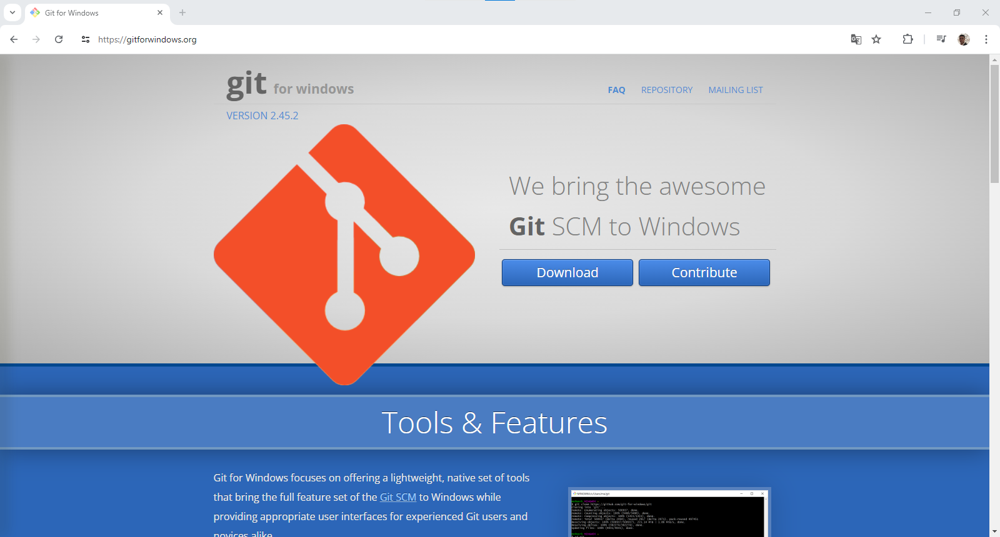

>Na opção em azul teremos o Download do nosso sistema de controle.

---

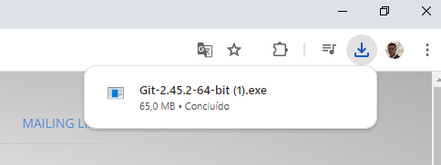

- Após efetuar o download, execute o instalador do git

---

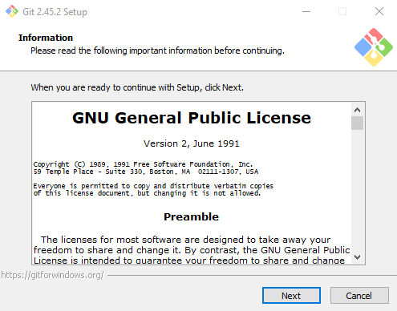

- Assim que estiver no instalador, escolha a opção "Next"

---

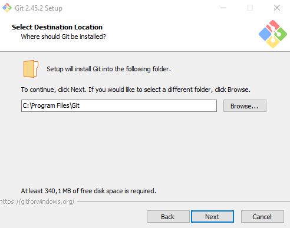

- Next novamente

---

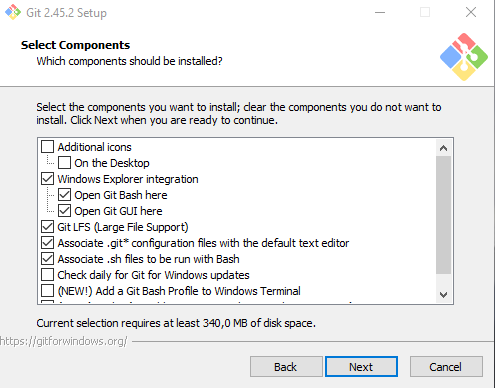

- Next novamente

---

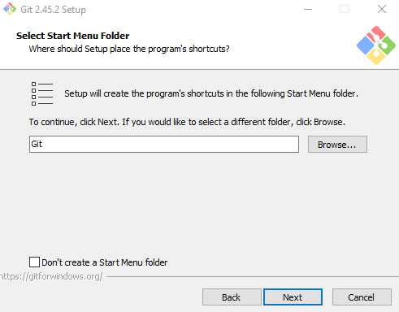

- Next novamente

---

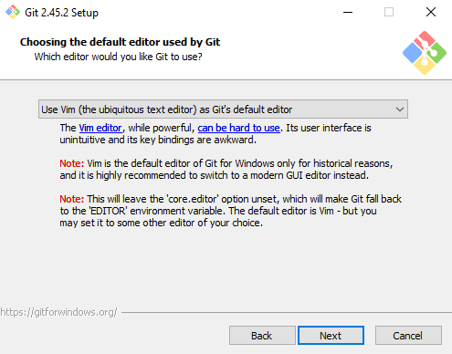

- Next novamente

---

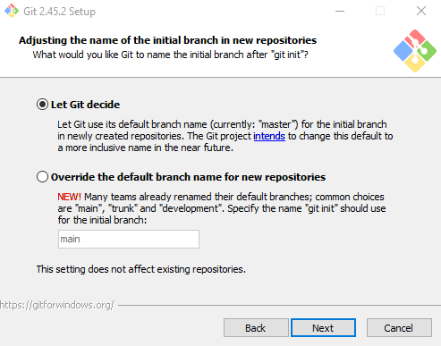

- Next novamente

---

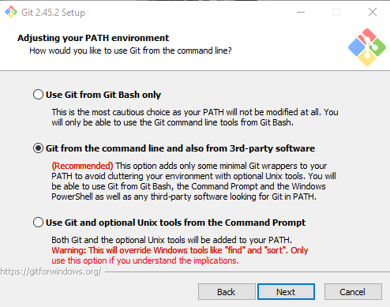

- Next novamente

---

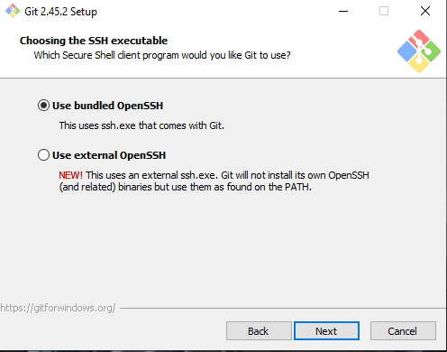

- Next novamente

---

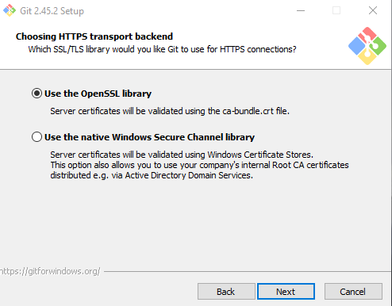

- Next novamente

---

- Next novamente

---

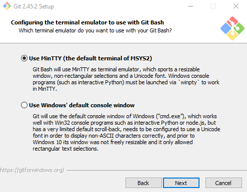

- Next novamente

---

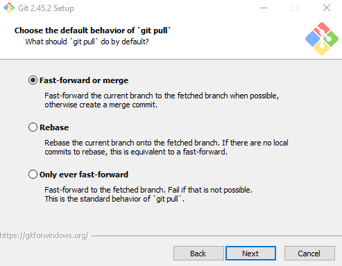

- Next novamente

---

- Next novamente

---

- Next novamente

---

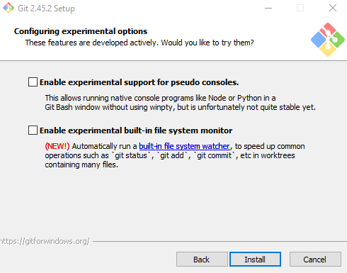

- Só clicar em "Instalar"
- Aguarde a instalação ser feita

---

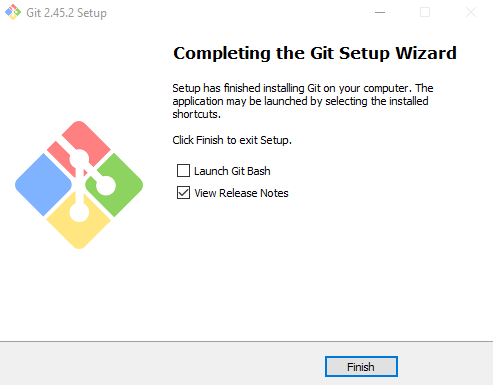

- E assim que estiver finalizado clique em "Finish"

---

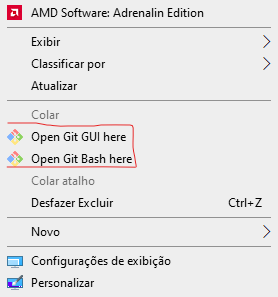

- E para verificar se está instalado só clicar com o botão direito do mouse e você vera o nome(como esta na foto a cima)
> Sé seu sistema operacional for o windows 11 clique com o botão direito e vá em "mais opções" e você vera o nome(como esta na foto a cima)

---

## 🥳 Instalação concluida !