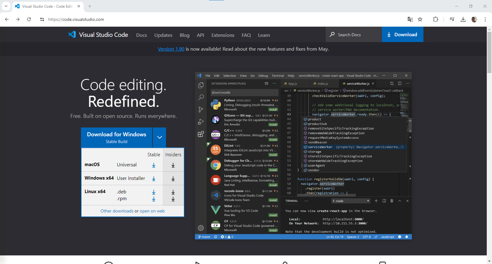
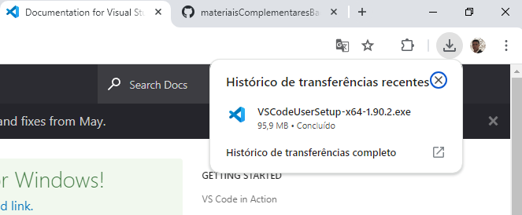
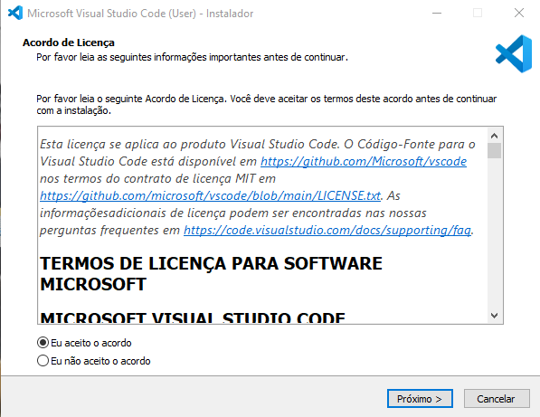
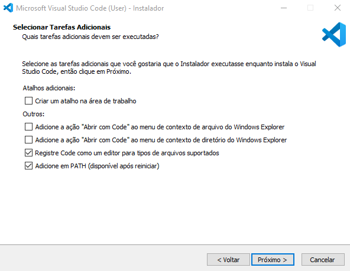
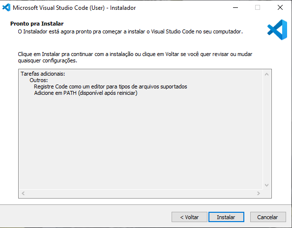
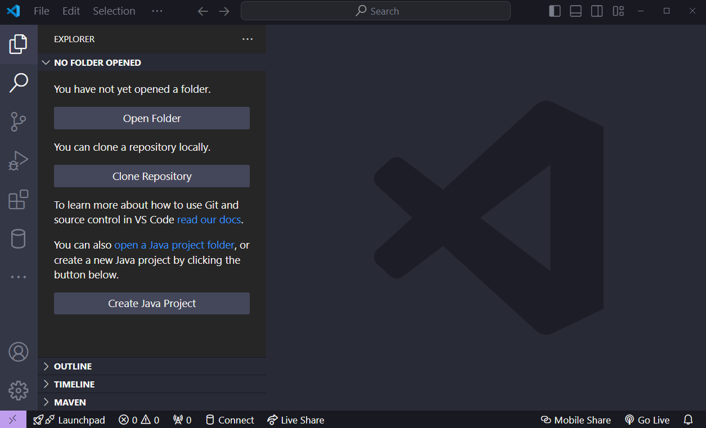

# Instalação visual studio Code

- Acessando o Visual studio Code [https://code.visualstudio.com/] para a instalação 

 > Na opção em azul teremos uma seta onde podemos escolher o sistema operacional, que o Download sera feito.

---

- Após efetuar o download, execute o instalador do vscode

---

- Assim que estiver no instalador, escolha a opção "Eu aceito o acordo"

- Depois clique em próximo

---

- Depois clique em próximo novamente

---

- Só clicar em "Instalar"
- Aguarde a instalação ser feita
- E assim que estiver finalizado clique em "Concluir"

---

- Você será redirecionado para o Visual studio Code com essa interface

---

## 🥳 Instalação concluida !