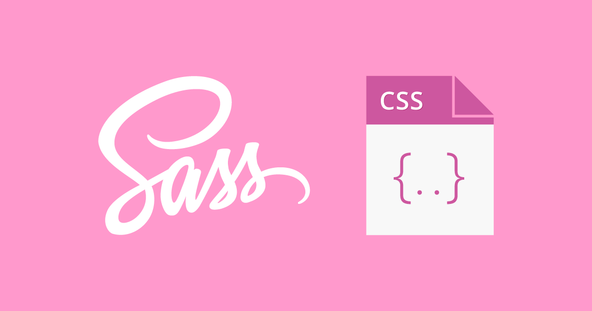
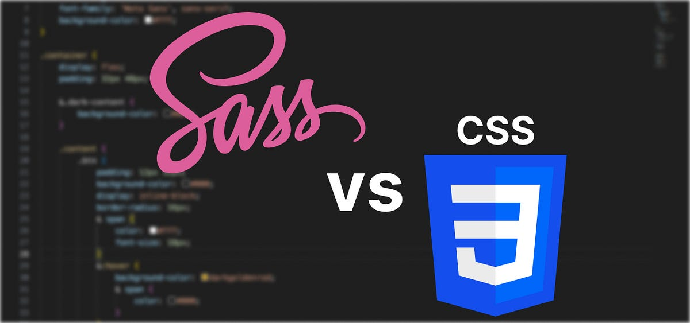
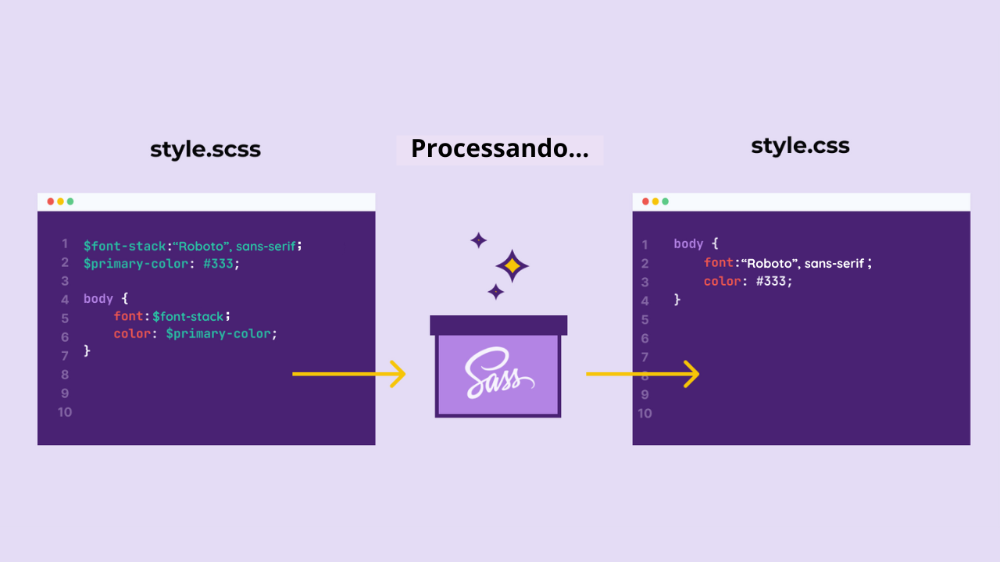

# O que é o Sass? 🤔

`Sass` abreviação de `Syntactically Awesome Style Sheets` em português `Folhas de Estilo Sintaticamente Incríveis` não é uma linguagem de programação, não é um framework ou uma biblioteca. Segundo a documentação oficial: `Sass é uma linguagem de estilização CSS com superpoderes`, se enquadrando como um `pré-processador de CSS`, ele nos permite ir além das capacidades do CSS puro. Adicionando diversos recursos como **variáveis**, **aninhamento**, **funções** e muito mais. Nos proporcionando uma maneira mais eficiente e organizada de escrever nossos estilos.

## Por que foi criado? 🤔

Foi criado em 2006 por Hampton Catlin **para superar as limitações do CSS puro** e tornar a escrita de estilos mais eficiente. **O CSS**, apesar de ser uma linguagem fundamental para o desenvolvimento web, apresenta algumas deficiências quando se trata de grandes projetos ou de manutenção de código ao longo do tempo.

Com o Sass, os desenvolvedores podem usar **variáveis**, **aninhamento de regras**, **mixins**, **herança** e outras funcionalidades avançadas que não estão disponíveis no CSS puro. Essas funcionalidades tornam o código mais reutilizável, facilitando a organização e a manutenção de projetos complexos.

**Em resumo, o Sass foi criado para fornecer aos desenvolvedores uma ferramenta poderosa que amplia as capacidades do CSS, tornando a criação e manutenção de estilos mais eficientes e agradáveis.**

## O que é um pré-processador CSS? ⚙️

Pré-processadores são uma **categoria de tecnologias de estilização que permitem escrever códigos CSS de uma forma mais dinâmica e poderosa**. Eles adicionam funcionalidades que não existem no CSS puro e corrigem problemas graves do CSS. **`Os pré-processadores processam o código escrito em sua sintaxe e os convertem em CSS tradicional, que será interpretado pelos navegadores`**. Ou seja, **`são chamados de pré-processadores porque, antes de o código ser lido pelo navegador e aplicado ao estilo, ele deve ser processado para CSS puro`**. Dessa forma, o navegador conseguirá ler e aplicar o estilo em sua página corretamente.

### Conclusão 🏁

Esta foi a introdução ao Sass. Nos próximos capítulos, continuaremos a explorar essa poderosa ferramenta que otimiza a escrita de CSS. À medida que exploramos e aplicamos o Sass, estarão preparados para enfrentar desafios em projetos web de qualquer escala, tornando suas aplicações mais elegantes e robustas.

🚀 Continue estudando!!! Na próxima lição vamos para a parte prática! 📚👨‍💻

<a style="font-size: 16px;" href="./02. Como utilizar Sass com HTML.md">Próxima matéria - Clique aqui!</a>

