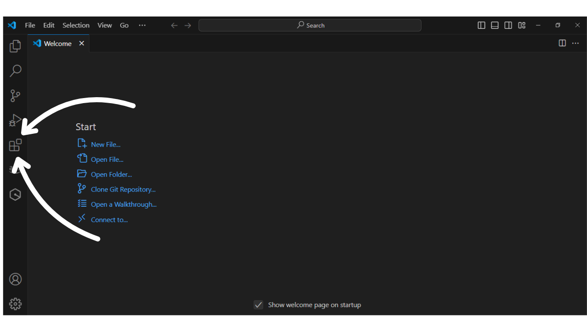
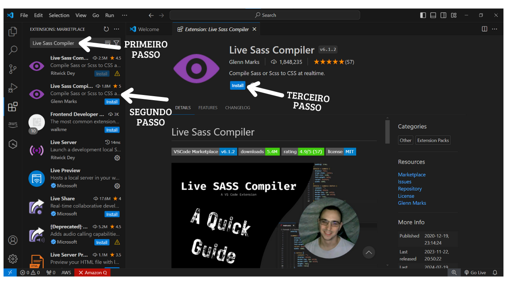
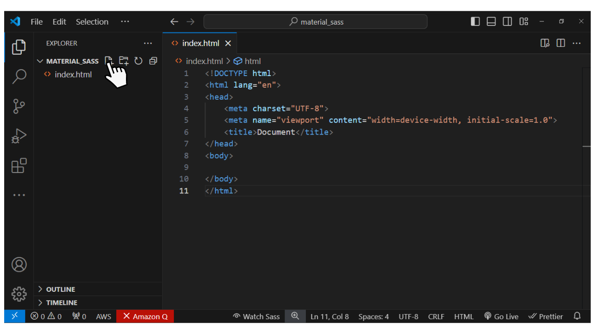
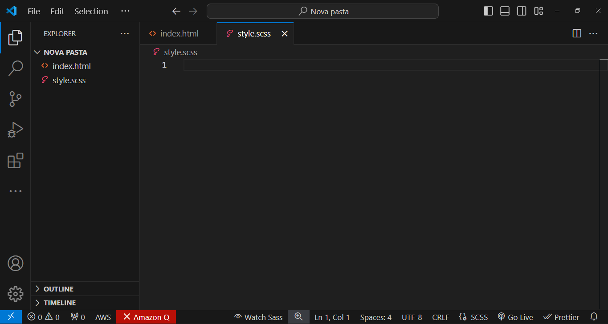
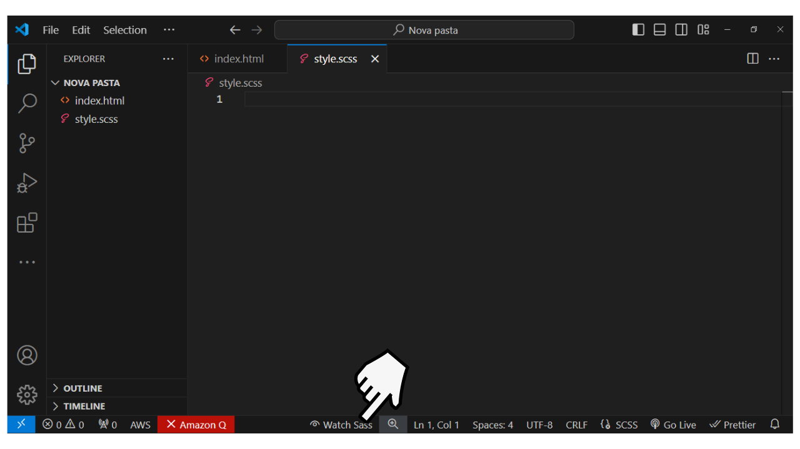
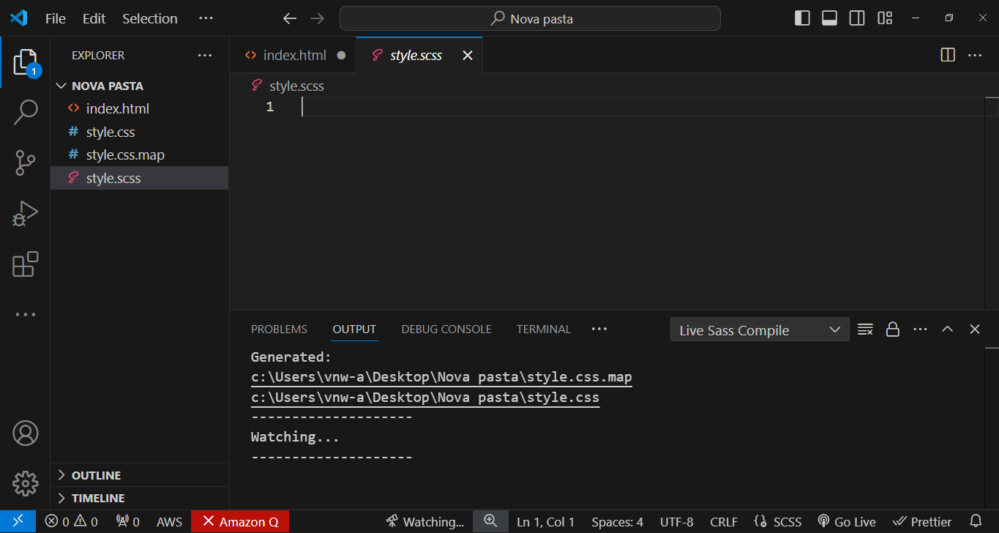
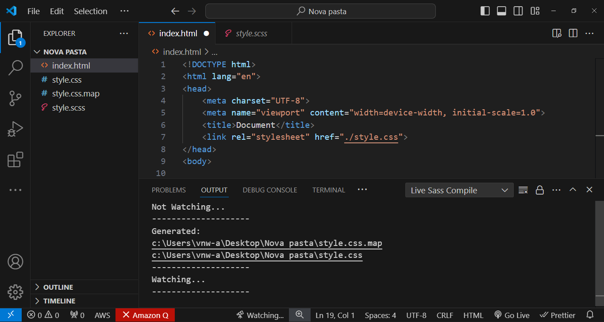
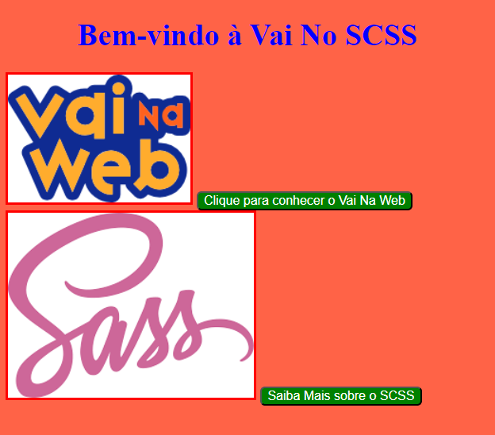

# Como utilizar o Sass com HTML? 🤔

O Sass é uma tecnologia extremamente versátil, podendo ser usada com diversas tecnologias front-end, como React, Angular, Vue, Next.js, e, é claro, com o nosso querido HTML. É com o HTML que iniciaremos a nossa jornada com o Sass.

Para começarmos a utilizá-lo, abra o **`Visual Studio Code`**, pois será necessário instalarmos uma extensão para trabalhar com Sass.

1. 🚀 Abra o Visual Studio Code.
2. 💻 Com o Visual Studio Code aberto, clique no ícone de quadrados na barra lateral esquerda, onde estará escrito "Extensões" (ou "Extensions", se estiver em inglês).



🎉 Uma vez que clicou na parte extensões, esses são os próximos passos:

1. 🔍 Na caixa de pesquisa na parte superior, digite: **`Live Sass Compiler`**
2. ✨ Clique na segunda opção que aparecer.
3. 📥 Por último, clique em "Instalar" para baixar essa extensão no Visual Studio Code.



🔧 **`Essa extensão será responsável por processar o nosso código Sass para CSS puro, permitindo que o navegador entenda o código transformado em CSS.`**

🚀 Uma vez que a extensão está instalada, já podemos partir para o código!

💻 No seu computador, abra o Visual Studio Code e crie uma pasta com um código HTML e coloque a estrutura básica (caso tenha esquecido a estrutura básica, pode utilizar o atalho `!` para criar automaticamente), como nas imagens abaixo:


🚀 O próximo passo é criar o nosso código Sass, **`style.scss`**, e, com a ajuda da extensão, conectá-lo ao nosso código CSS processado, como mostrado nas imagens abaixo:

### Primeiro passo: criar o arquivo `style.scss`





### Segundo passo: transformar o nosso código `Sass` em `CSS` utilizando a extensão

#### 🔄 Para ativar a extensão, clique em `Watch Sass`





#### 📝 Uma vez que clicamos em `Watch Sass`, serão gerados dois arquivos CSS: `style.css` e `style.css.map`. Ambos têm suas funções específicas que iremos conhecer abaixo:

- ## `style.css`

    📄 O `style.css` é o arquivo que receberá o código CSS processado pela extensão e que será lido pelo navegador. **NÃO MEXEMOS NESSE CÓDIGO**. Nós mexeremos apenas no arquivo **`style.scss`**. Ambos os arquivos com a extensão `.css` são o resultado da transformação do código SCSS para CSS, para que o navegador possa lê-los.

- ## `style.css.map`

    🗺️ O `style.css.map` é um arquivo gerado a partir da transformação do SCSS para CSS. Ele é usado para mapear o código fonte SCSS para o código CSS processado, facilitando a depuração. **NÃO MEXEMOS NESSE CÓDIGO**.

- ## `style.scss`
    
    ✍️ Este será o arquivo onde nós criaremos o nosso estilo SCSS. Nele, iremos escrever todo o nosso estilo, aproveitando todas as funcionalidades que o SCSS proporciona.

#### Terceiro passo: linkar o código transformado em `CSS` com o código `HTML` que receberá o estilo através da tag `<link rel="stylesheet" href="./styles.css"/>` como no código abaixo:

```html
<!DOCTYPE html>
<html lang="pt-br">
<head>
    <meta charset="UTF-8">
    <meta name="viewport" content="width=device-width, initial-scale=1.0">
    <title>Document</title>
    <link rel="stylesheet" href="./style.css" />
</head>
<body>
    
</body>
</html>
```



### 🌟 Uma vez que linkamos o `index.html` com o `style.css`, como mostrado na linha 7, é hora de começar a criar nossa página. Vamos fazer um exemplo simples para fixar o conhecimento!

### Exemplo: 
Vamos criar uma página que contenha um título principal, duas imagens e dois botões, aplicando o primeiro conceito de SCSS: variáveis. Vamos falar mais sobre variáveis nos próximos capítulos, mas, por enquanto, saiba que uma variável em SCSS nos permite definir valores reutilizáveis para usar em várias partes do código.

### HTML

```html
<!DOCTYPE html>
<html lang="pt-br">
<head>
    <meta charset="UTF-8">
    <meta name="viewport" content="width=device-width, initial-scale=1.0">
    <title>Vai No SCSS</title>
    <!-- NÃO SE ESQUEÇA DE LINKAR O STYLE.CSS NA TAG LINK -->
    <!-- LEMBRE-SE DEVE LINKAR O CÓDIGO GERADO PELA EXTENSÃO -->
    <link rel="stylesheet" href="./style.css" />
</head>
<body>

<h1>Bem-vindo à Vai No SCSS</h1>

    
    <button>Clique para conhecer o Vai Na Web</button>
    
    
    <button>Saiba Mais sobre o SCSS</button>

</body>
</html>
```
### Arquivo de estilo da página em SCSS (style.scss)

```scss

// Definindo variáveis
$cor-primaria: blue;
$cor-secundaria: green;
$melhor-cor-do-mundo: tomato;

body{
    background-color:$melhor-cor-do-mundo;
}

h1 {
    color: $primary-color;
    text-align: center;
}

img {
    border:solid red;
}

button {
    background-color: $secondary-color;
    color: white;
    cursor: pointer;
    border-radius: 5px;
}
```

## **Explicando o código:**
 
### **Variáveis:**

**`$cor-primaria:`** 🔵 Está guardando a cor primária azul.  
**`$cor-secundaria:`** 🟢 Está guardando a cor secundária como verde.  
**`$melhor-cor-do-mundo:`** 🍅 Está guardando uma cor de fundo (tomato).  

### **Estilização do Body:**

**`background-color: $melhor-cor-do-mundo;`** 🍅 Define a cor de fundo da página com a cor atribuída à variável `$melhor-cor-do-mundo`.  

### **Estilização do Título (h1):**

**`color: $cor-primaria;`** 🔵 Define a cor do título como a cor atribuída à variável `$cor-primaria`. 

**`text-align: center;`** 🎯 Centraliza o texto do título.  

### **Estilização das Imagens (img):**

**`border: solid red;`** 🔴 Define uma borda sólida vermelha para todas as imagens.  

### **Estilização dos Botões (button):**

**`background-color: $cor-secundaria;`** 🟢 Define a cor de fundo dos botões com a cor da variável `$cor-secundaria`.  
**`color: white;`** ⚪ Define a cor do texto dos botões como branca.
 
## Resultado Final

<p style="font-size: 16px;">Ao final nossa linda página estilizada com SCSS ficará dessa forma abaixo🤩:</p>



<p style="font-size: 16px;">Lembrando, que o design foi criado apenas para prática😂😂😂</p>


### Conclusão 🏁

<p style="font-size: 16px;">À medida que você pratica, perceberá como o SCSS é essencial. Ele permite organizar seu código de maneira eficiente e criar estilos mais personalizados. A exploração e aplicação do SCSS em diferentes contextos é crucial para dominar o desenvolvimento de estilos dinâmicos. Lembre-se, a prática contínua é fundamental para aprimorar suas habilidades.</p>

<p style="font-size: 16px;">🚀 Continue praticando e explorando! Bons códigos e vamos para os exercícios! 📚👨‍💻</p>


<a style="font-size: 16px;" href="./Exercicios/1.Utilizando Sass com HTML.md">Exercícios - Clique aqui!</a>

<a style="font-size: 16px;" href="./03. Variáveis em Sass.md">Próxima matéria - Clique aqui!</a>