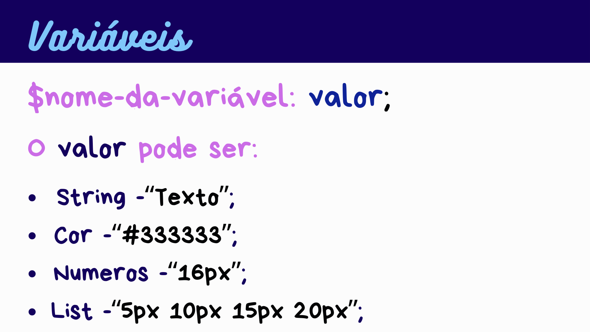

<h1>Variáveis em Sass 🎨</h1>

Ao utilizarmos o **`Sass`**, um dos recursos principais e iniciais são as **`variáveis`**, um recurso que parece básico, porém **vital para a otimização do código e desempenho da página.**

Mais adiante, em **lógica de programação** conheceremos, mais a fundo o conceito de variáveis e sua manipulação. No entanto, neste momento, o que devemos saber é que variáveis servem para guardar algum dado, como uma **cor**, **altura de um elemento**, **largura**, ou valor CSS. A sintaxe de definição delas é quase igual à sintaxe de definição de propriedades de CSS. A diferença é que o nome da variável é precedido por `$`. Elas também são acessadas com o `$` antes do nome delas.

- `Variáveis no SASS facilitam a reutilização de valores em diferentes partes do código.`

- `Ajudam a manter o código mais organizado e legível.`

- `As variáveis também simplificam a manutenção futura e a atualização de valores.`



<h3>Outros exemplos:</h3>

```scss
// String
$fonte-principal: "Arial, sans-serif";
$fonte-secundaria: "Helvetica, sans-serif";
```
```scss
// Cor
$minha-cor: "#333333";  // Hexadecimal
$cor-rgb: rgb(255, 87, 51);  // RGB
$cor-hsl: hsl(14, 100%, 60%);  // HSL
$nome-da-cor: red;  // Nome da cor
```
```scss
// Números
$meu-numero-px: 16px;  // Com unidade 'px'
$meu-numero-em: 2em;  // Com unidade 'em'
$meu-numero-percent: 50%;  // Com unidade '%'
```
```scss
// Lista
$minha-lista: 5px 10px 15px 20px;  // Lista de espaçamentos
$cores-lista: red blue green yellow;  // Lista de cores
$fontes-lista: 'Arial', 'Helvetica', 'sans-serif';  // Lista de fontes
```

<h3>Exemplo prático declaração e uso de variáveis:</h3>

```scss
// Variáveis
$cor-primaria: #333; // 🎨 Cor primária
$melhor-cor: tomato; // 🎨 Melhor cor do mundo

$espacamento-padrao: 10px; // 📏 Espaçamento
$tamanho-padrao: "2em"; // 📏 Tamanho de fonte padrão

body {
  background-color: $cor-primaria; // 🖌️ Cor do texto
  padding: $espacamento-padrao; // 📦 Espaçamento interno
}

h1 {
  color: $melhor-cor; // Cor do titulo
  font-size: $tamanho-padrao; // Tamanho do titulo
}
```

```html
<!DOCTYPE html>
<html lang="pt-br">
  <head>
    <meta charset="UTF-8" />
    <meta name="viewport" content="width=device-width, initial-scale=1.0" />
    <title>Vai No SCSS</title>
    <!-- NÃO SE ESQUEÇA DE LINKAR O STYLE.CSS NA TAG LINK -->
    <!-- LEMBRE-SE DEVE LINKAR O CÓDIGO GERADO PELA EXTENSÃO -->
    <link rel="stylesheet" href="./style.css" />
  </head>
  <body>
    <h1>Esse título tem a melhor cor do mundo</h1>
  </body>
</html>
```

## Resultado Final 🖼️

Ao final, utilizando o Sass e suas variáveis, nossa página ficará dessa forma!!!


Lembrando que o design foi criado apenas para prática 😂😂😂

### Conclusão 🏁

À medida que você pratica, perceberá a importância das variáveis no SCSS. Explorar e aplicar variáveis em diferentes contextos é crucial para dominar o desenvolvimento de estilos dinâmicos.

🚀 Continue praticando e explorando! Bons códigos e vamos para os exercícios! 📚👨‍💻

<a href="./Exercicios/2. Variáveis em Sass.md" style="font-size:16px;">Exercícios - Clique aqui!</a>

<a href="./04. Nesting em Sass.md" style="font-size:16px;">Próxima matéria - Clique aqui!</a>
