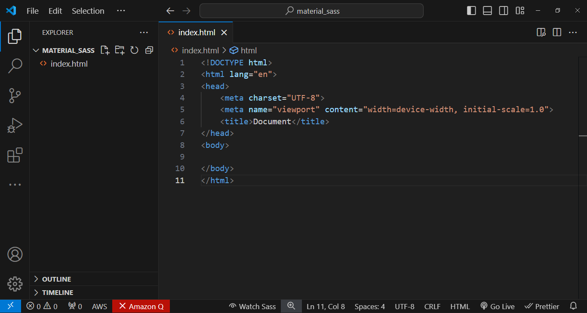

# Nesting e Herança em Sass 🧬

O Nesting (aninhamento) em Sass é um dos recursos mais poderosos e práticos do Sass. Ele permite que o código fique mais limpo e legível, tanto para você desenvolvedor/desenvolvedora como para os integrantes de sua equipe. 🌟

## Como utilizar o Nesting? 🤔

O aninhamento de seletores em Sass permite que os estilos sejam agrupados de forma hierárquica, seguindo a estrutura do HTML. Isso promove uma organização mais intuitiva e reduz a repetição de código.
Esse agrupamento permite que acessemos tags e as modifiquemos de forma mais simples e rápida.

Vamos analisar o exemplo abaixo:

Suponha que você tenha o seguinte código HTML:

```html
<!DOCTYPE html>
<html lang="pt-br">
  <head>
    <meta charset="UTF-8" />
    <meta name="viewport" content="width=device-width, initial-scale=1.0" />
    <title>Document</title>
  </head>
  <body>
    <header>
      <nav>
        <ul>
          <li>Inicio</li>
          <li>Sobre</li>
          <li>Contatos</li>
        </ul>
      </nav>
    </header>
    <main>
      <figure>
        
      </figure>
    </main>
    <footer>
      <nav>
        <ul>
          <li>Fale Conosco</li>
          <li>Termos de Uso</li>
          <li>Políticas de Privacidade</li>
        </ul>
      </nav>
    </footer>
  </body>
</html>
```

Nesse código HTML podemos perceber que é composto pelas principais tags semânticas, `<header>`, `<main>`, `<footer>`. Podemos observar que dentro desse código há algumas tags que se repetem, como `<nav>`, `<ul>` e `<li>`. Como faríamos para selecionar e diferenciar essas tags que se repetem? 🤔

No CSS tradicional, temos alguns recursos que podem nos ajudar, como a hierarquia e as classes. No entanto, em determinado ponto, as classes tornam o nosso código poluído e utilizar a hierarquia se torna repetitivo. É aí que o **Nesting (Aninhamento)** do Sass entra em ação. Ele permite que acessemos tags sem o uso de classes e sem a parte repetitiva da hierarquia. Vamos entender como isso funciona analisando o código Sass abaixo: 💡

```scss
// Variáveis
$primary-color: #3498db;
$secondary-color: #2ecc71;
$text-color: #333;
$background-color: #f5f5f5;
$font-size: 16px;
$li-text-color: #000;

// Estilos para Header
header {
  background-color: $primary-color;
  text-align:center;

  nav {
    border: dotted blue;
  }

  ul {
    border:solid red;
  }

  li {
    display: inline-block;
    font-size:$font-size;
    color: $li-text-color;
    cursor: pointer;
  }
}

// Estilos para Main
main {
  
  padding-left:250px;
  padding-right:250px;

  figure {
    background-color: $background-color;
    text-align: center;
  }

  img {
    width:250px;
    height: 250px;
  }
}

// Estilos para Footer
footer {
  background-color: $primary-color;

  nav {
    border:dashed tomato;
  }

  ul {
    list-style: none;
  }

  li {
    cursor: pointer;
  }
}
```

Nesse código Sass, utilizamos o Nesting (Aninhamento) e Variáveis de forma prática e eficiente, permitindo acessar e modificar as tags através da hierarquia. Vamos examinar os estilos para o header e o footer:

```scss
// Estilos para Header
header {
  background-color: $primary-color;
  text-align:center;

  nav {
    border: dotted blue;
  }

  ul {
    border:solid red;
  }

  li {
    display: inline-block;
    font-size:$font-size;
    color: $li-text-color;
    cursor: pointer;
  }
}
```

Aqui, estamos acessando as tags `<nav>`, `<ul>` e `<li>` que estão contidas dentro da tag `<header>`. Somente as tags que estão dentro do `<header>` serão estilizadas dessa maneira.

O mesmo se repete ao `<footer>`, quando analisamos o código:

```scss
// Estilos para Footer
footer {
  background-color: $primary-color;

  nav {
    border:dashed tomato;
  }

  ul {
    list-style: none;
  }

  li {
    cursor: pointer;
  }
}
```

Neste exemplo, o mesmo se aplica: estamos acessando e estilizando apenas as tags `<nav>`, `<ul>` e `<li>` que estão dentro da tag `<footer>`.

O uso de aninhamento (Nesting) e variáveis no Sass facilita a manutenção e organização do código, permitindo que os estilos sejam aplicados de forma específica e eficiente dentro da estrutura hierárquica do HTML.

## Resultado Final 🖼️

Ao final, utilizando o Sass e o Nesting, nossa página ficará dessa forma!!!


Lembrando que o design foi criado apenas para prática 😂😂😂

### Conclusão 🏁

À medida que você pratica, perceberá a importância do Nesting no SCSS. Explorar e aplicar o Nesting em diferentes contextos é crucial para dominar o desenvolvimento de estilos dinâmicos.

🚀 Continue praticando e explorando! Bons códigos e vamos para os exercícios! 📚👨‍💻

<a href="#">Exercícios - Clique aqui! Em construção...</a>

<a href="#">Próxima matéria - Clique aqui!</a>
