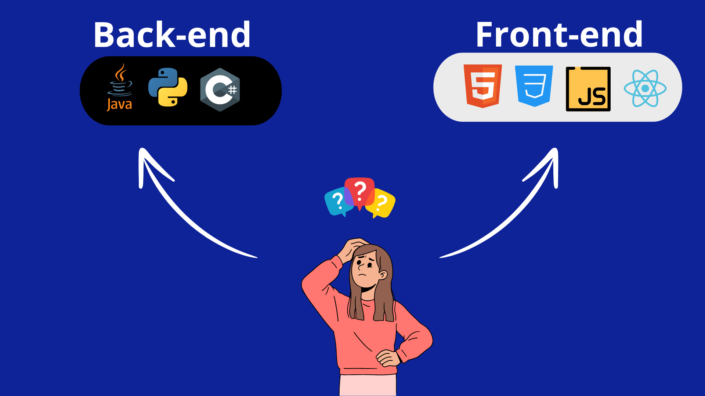
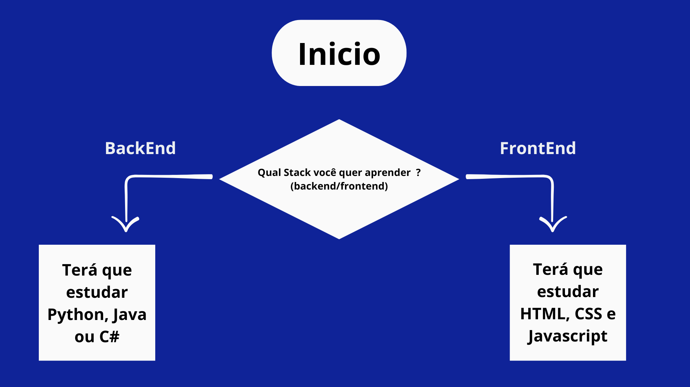
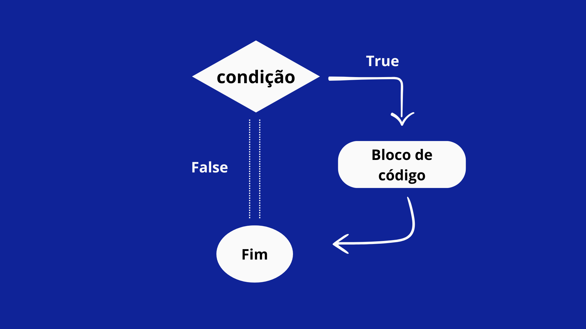

# Estruturas condicionais

A hora de entender as estruturas condicionais na linguagem Javascript.

em qualquer linguagem de programação, o código deve tomar decisões e realizar ações de acordo com entradas e/ou variáveis. 

São desvios que o seu código irá tomar.

<div align='center'>
    
</div>

Assim como alguem decide se vai pelo caminho BackEnd ou FrontEnd, você pode colocar condicionais nos seus códigos.

Para manipular as decisões, temos de ter controle dos operadores lógicos. Esses operadores são muito utilizados em condicionais para fazerem uma comparação.

| Operador | Nome | Descrição | Exemplo | Resultado |
|----------|------|-----------|---------|-----------|
|   `&&`   | AND(E) |  Retorna `true` se ambos os operandos forem `true`; caso contrário, retorna `false`. | `true && false` |    `false`         |
| \|\| |OR(ou)| Retorna `true` se pelo menos um dos operandos for `true`; caso contrário, retorna `false`.|  `true \|\| false`  | `true` |                                           | `!`      | NOT (NÃO)            | Inverte o valor lógico do operando. Se for `true`, retorna `false`, e vice-versa.         | `!true`              | `false`                                                                                     |
| `==`     | Igualdade            | Compara dois valores para igualdade, sem considerar o tipo.                              | `5 == '5'`           | `true`                                                                                      |
| `===`    | Estritamente igual   | Compara dois valores para igualdade, considerando o tipo.                                | `5 === '5'`          | `false`                                                                                     |
| `!=`     | Diferente            | Compara dois valores para desigualdade, sem considerar o tipo.                           | `5 != '5'`           | `false`                                                                                     |
| `!==`    | Estritamente diferente | Compara dois valores para desigualdade, considerando o tipo.                             | `5 !== '5'`          | `true`                                                                                      |
| `>`      | Maior que            | Retorna `true` se o operando da esquerda for maior que o operando da direita.            | `5 > 3`              | `true`                                                                                      |
| `<`      | Menor que            | Retorna `true` se o operando da esquerda for menor que o operando da direita.            | `5 < 3`              | `false`                                                                                     |
| `>=`     | Maior ou igual que   | Retorna `true` se o operando da esquerda for maior ou igual ao operando da direita.      | `5 >= 5`             | `true`                                                                                      |
| `<=`     | Menor ou igual que   | Retorna `true` se o operando da esquerda for menor ou igual ao operando da direita.      | `5 <= 3`             | `false`          |

Entendendo esses conceitos ficará mais fácil manipular as estruturas de decisão.

---

## Mas como fazer ?

- ### If - else:
  
  If e Else é uma estrutura condicional que executa um bloco a partir de uma condição

    <div align='center'>
        
    </div>
    Transformando em código temos:
```Javascript
    // Pergunta ao usuário qual stack ele deseja seguir
const stack = prompt("Qual stack você deseja seguir? (backend ou frontend)");

// Verifica a resposta do usuário e exibe a mensagem correspondente
if (stack.toLowerCase() === "backend") {
    alert("Você terá que aprender Python, Java ou C#.");
} else if (stack.toLowerCase() === "frontend") {
    alert("Você terá que aprender HTML, CSS e JavaScript.");
} else {
    alert("Opção inválida. Por favor, escolha entre 'backend' ou 'frontend'.");
}
```

Apenas com essas imagens ainda fica um pouco vago de se entender essa estrutura. Então vamos entender a fundo.

If e Else são palavras em inglês que traduzidas, são Se e Senão.

O programa irá rodar até chegar nesse bloco de condição, onde o desvio acontecerá

<div>
    
</div>

<br>

```Javascript
if(idade >= 18){
    console.log("O voto é obrigatório")
}
```

>No código acima, temos uma condicional que irá imprimir no console que o voto é Obrigatório para pessoas com 18 anos ou mais

Vamos utilizar mais dos operadores lógicos ?

```Javascript
if(idade >= 18 && idade < 70){
    console.log("O voto é obrigatório")
} else if (idade >= 15 && idade > 70){
    console.log("O voto é opcional")
}else {
    console.log("Você não pode votar")
}
```
>No código acima temos 3 blocos de código. Um bloco verifica se a idade é maior ou igual a 18 **E** idade é menor do que 70. Se essas condições forem verdadeiras, o console log irá imprimir **O Voto é obrigatório** no console. Caso essa primeira condição seja falsa, as outras condições serão verificadas. 1

 - ### Switch Case:
  O switch case em JavaScript desempenha um papel fundamental na qualidade e na manutenção do seu código, tornando-o mais compreensível para outros desenvolvedores que possam examiná-lo.
  
  A estrutura é extremamente eficaz para variáveis que podem assumir diferentes valores no código. Em resumo, Diminuí a quantidade de If e Else no código.
  
  Vamos ver na prática uma otimização com o `switch-case`

  ```Javascript
  const linguagem = "Javascript";
  
  if(linguage === "Javascript"){
    console.log("WOOOW! Suas habilidades com Javascript são excepcionais");
  }else if(linguagem === "Python"){
        console.log("A encarnação de Python");
  }else if(linguagem === "Java"){
    console.log("Coragem é a sua definição. Que maestria você tem com a linguagem!!");
  }else if (linguagem === "C"){
    console.log("Prepare-se para ponteiros de ponteiros. É uma ótima escolha começar com a mãe de todas as linguagens");
  }
  ```
  E mais uma infinidade de outras linguagens que poderiamos citar aqui. 
  
  É um código funcional, mas pode ser otimizado com o switch-case

  Para obtermos um resultado como o do código acima, começaremos com a palavra chave switch(), onde, dentro dos parênteses, passaremos a variável que queremos manipular, que no nosso caso é a variável `linguagem`.

  Em seguida, atribuiremos os casos (case) e as respostas, ou seja, os blocos de código que devem ser executados para cada variável.

  O código ficará assim: 

  ```Javascript
  const linguagem = "Javascript" ;

    switch(linguagem){
        case "Javascript": 
            console.log("WOOOW! Suas habilidades com Javascript são excepcionais");
            break;
        case "Python": 
            console.log("A encarnação de Python");
            break;
        case "Java": 
            console.log("Coragem é a sua definição. Que maestria você tem com a linguagem!!");
            break;
        case "C": 
            console.log("Prepare-se para ponteiros de ponteiros. É uma ótima escolha começar com a mãe de todas as linguagens");
            break;
    }
  ```
É perceptivel a adição de uma palavra `break`. Sem essa instrução, ele continuará executando todos os outros blocos de código abaixo da correspondência encontrada, causando o que conhecemos como **"Efeito Cascata (ou fall-through)".**. Com isso o fluxo continuará para o próximo caso.

Dentro da estrutura ainda nos deparamos com uma instrução muito importante, o `default`. Essa instrução tem um bloco de códigoque será ocupado caso nenhum dos cases sejam verdadeiros

Então, nosso código completo seria:
  ```Javascript
  const linguagem = "Javascript" ;

    switch(linguagem){
        case "Javascript": 
            console.log("WOOOW! Suas habilidades com Javascript são excepcionais");
            break;
        case "Python": 
            console.log("A encarnação de Python");
            break;
        case "Java": 
            console.log("Coragem é a sua definição. Que maestria você tem com a linguagem!!");
            break;
        case "C": 
            console.log("Prepare-se para ponteiros de ponteiros. É uma ótima escolha começar com a mãe de todas as linguagens");
            break;
        default:
            console.log("Opa, perdão. Ainda não não temos familiaridade com essa tecnologia.")
    }
  ```

A utilização dessa estrutura nós conseguimos simplificar os códigos, aprimorá-los e torná-los mais eficientes.

Sugerimos que vocês pratiquem bastante para alcançar a maestria na manipulação dessas estruturas condicionais.