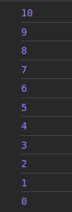

# Estruturas de repetição :arrows_counterclockwise:

Em algum momento do seu código você precisou executar instruções semelhantes em uma certa quantidade de vezes.

Imagine que você recebeu um desafio. Fazer uma contagem regressiva do número 10 até o 0.

```Javascript
console.log("10");
console.log("9");
console.log("8");
console.log("7");
console.log("6");
console.log("5");
console.log("4");
console.log("3");
console.log("2");
console.log("1");
console.log("0");
```

Dessa forma teremos certeza de que a contagem será realizada. Mas existe uma maneira de otimizar essa escrita.

Vamos mais além. No desafio, a contagem regressiva tem que iniciar do número 100... 😨

Seria muito complicado e cansativo escrever 100 linhas com `console.log()`. 

Mas acalme o coraçãozinho. Iremos conhecer nossas estruturas de repetição. 

Essas estruturas, também conhecidas como **loops** permitem a execução de um bloco de instrução na quantidade de vezes que determinarmos. Temos o for, while e do-while. 

- ### for()
  
A estrutura se baseia em uma condição com os operadores lógicos. Enquanto a condição **verdadeira (true)**, o loop continua executando, mas, quando a condição for falsa, o loop não é executado.

A sintaxe é:


```Javascript
 for( [inicialização] ; [condição] ; [expressão final] ) {
    //Instruções
 }
```

Agora vamos fazer a nossa contagem com a estrutura for

```Javascript
for(i = 10; i >= 0 ; i--){
    console.log(i)
}
```
Para o auxilio dessa estrutura, trabalhamos com a variável local i, um padrão utilizado no mundo da programação. A varíavel poderia ter outros nomes também.

> a variável i se inicia com 10 ; enquanto i for maior ou igual a zero ; subtraia um numero da variável i.

Acima temos a leitura da condição. **i--** é igual **i = i - 1**

Com o arquivo linkado ao HTML, temos na saída do console.

<div >
    
</div>

Viu como foi otimizado ? As 11 se transformaram em 2 linhas de instrução.

Mas ainda não acabou, temos outras estrutras que precisamos conhecer. 

- ### While()
  
  Conheceremos o loop `while()`. Diferente do for(), a estrutura continua executando as linhas de instrução caso a condição seja avaliada como **verdadeira (true)**.

  a sintaxe é:

  ```Javascript
  while(condição) {
    //instruções
  }
  ```
  Aqui temos de ter muito cuidado, pois, é a estrutura mais fácil de gerar um ***loop infinito***.

  >Loops infinitos são ações que são executadas infinitamente durante a execução do script. Quando lançado, temos que parar forçadamanete a execução do programa.

  Vamo realizar a contagem regressiva novamente ? 

  ```Javascript
  numero = 10;

  while(numero >= 0){
    console.log(numero);
    numero--;
  }
  ```

  A saída continua sendo a contagem regressiva de 10 até o 0.

  Reparem que essa estrutura também precisa de uma variável que irá auxiliar a contagem e a decrementação com o **numero--**

  A leitura do código fica: 

  > A variável número contém o 10. Enquanto o numero for maior ou igual a 0, imprima no console o numero, após isso, subtraia 1 número da variável numero.

  Tome muito cuidado, pois, a ausência da instrução **numero--** causaria um looping infinito, o número 10 seria impresso infinitamente no console até forçar o fim da execução do programa.

- ### Do-while()
A declaração do...while cria um laço que executa uma declaração até que o teste da condição for **falsa (false)**. A condição é avaliada depois que o bloco de código é executado, resultando que uma declaração seja executada pelo menos uma vez.

A sintaxe é: 

```Javascript

do {
    //Instruções
} while(condição); 

```

Para fazer a contagem regressiva:

```Javascript
numero = 10;

do{
    console.log(numero);
    numero--;
}while(numero >= 0);
```

A leitura do código fica:
> A variável numero contém o 10; Faça a impressão do conteúdo da variável e após isso, subtraia a mesma com o 1; o loop continuará enquanto a variável tiver o valor maior ou igual a 0.


Ao aprender essas estruturas é possível otimizar muitas funcionalidades, por isso, é crucial um bom entendimento das mesmas. 

Estude, pratique e pratique bastante! 

