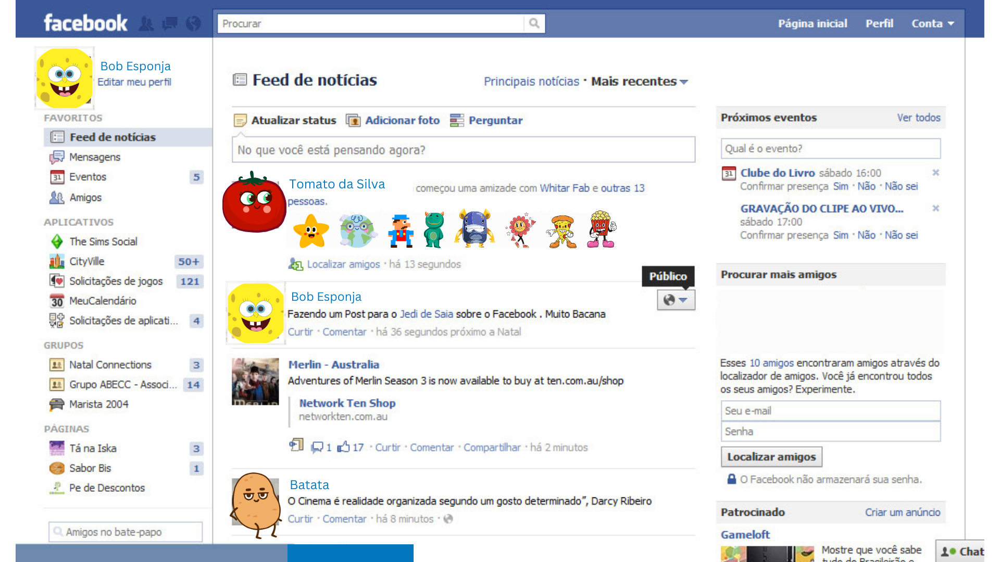

# O que é o React? 🤔

O React é uma biblioteca (lib) baseada em JavaScript, voltada para a criação de interfaces de usuário (UI) reativas. Criado em 2011, o React foi desenvolvido inicialmente para o feed de notícias do Facebook. Naquela época, havia muita dificuldade em sincronizar as diferentes interações na página do Facebook, feita inteiramente em HTML, CSS e JavaScript. Conforme o tempo passava e a aplicação crescia, a lógica para atualizar todas aquelas informações tornava-se muito complexa.

  
*Essa era a tela inicial do Facebook que, com o tempo, tornou-se muito complexa de manter e atualizar inteiramente em HTML, CSS e JavaScript.*

O React, criado em JavaScript, foca em facilitar a criação de interfaces de usuário de maneira fácil, além de simplificar as atualizações e funcionalidades em nossas aplicações. Seu diferencial é que não precisamos de todos os processos utilizados no DOM para fazer uma mudança em algum valor ou alterar algo na tela.

Atualmente, algumas empresas que utilizam React incluem: 
- Facebook 📘
- Instagram 📷
- Netflix 🍿
- Spotify 🎵
- Airbnb 🏠
- Uber 🚗
- Slack 💬
- GitHub 🐙
- e muitas outras...

## Como ele funciona? 🛠️

O React é escrito em JSX, que é a linguagem adotada para a escrita do código. Essa linguagem é, na realidade, a mistura de HTML, CSS e JavaScript juntas, onde todas essas tecnologias se tornam JSX e são escritas em um único arquivo.

Essa união proporciona uma maneira mais fluida e organizada de implementar a lógica do código, visto que todos os elementos necessários estão contidos em um único arquivo.

## Componentes do React 🧩

O React utiliza o conceito de componentes. Esses componentes são como peças de LEGO que você cria inicialmente de forma separada e, depois, os junta para construir sua interface de usuário. Cada peça, ou componente, representa uma parte da sua interface, e você pode reutilizá-los em diferentes partes do seu aplicativo para construir uma interface coesa e funcional.

<h1 align="center">Componentes de uma Aplicação React</h1>

  
*Na imagem acima, é exibido como funciona o conceito de componentes no React. Um componente pode ser tão pequeno quanto um botão ou tão grande quanto uma página inteira, dependendo do tamanho de sua aplicação em React, ela pode ter diversos componentes diferentes.*

## Como criar um projeto em React Js 🚀

1. **Primeiro Passo:**  
   Baixe o [NodeJs](https://nodejs.org/en), uma ferramenta que permitirá criarmos nossa aplicação em React. O NodeJs nos dá acesso ao npm (Node Package Manager), que é como uma grande loja onde desenvolvedores podem compartilhar e baixar "pacotes" que outras pessoas criaram para resolver problemas comuns.  
   [Clique aqui para baixar o Node!](https://nodejs.org/en)  

   *Nota: Para baixar o Node no Windows, clique no link acima, assim que começar a instalação basta pressionar o botão Next (Próximo) e Instalar.*

3. **Segundo Passo:**  
   Com o Node baixado, abra um VSCODE vazio, pressione `CONTROL + J` para abrir o terminal do VSCODE e insira o comando:  **npm create vite@latest**

4. **Terceiro Passo:**  
O terminal irá pedir o nome do seu projeto em React.  
Project name: nome-do-projeto
(Você pode colocar o nome que preferir)

Após isso, ele lhe dará uma série de opções de tecnologias para selecionar. Selecione a terceira opção(React), utilizando as setas do seu teclado ⬆️ ⬇️ ⬅️ ➡️:  
- Vanilla
- Vue
- **React**
- ... outras opções ...

1. **Escolha da Variante do React:**  
Selecione a terceira opção(JavaScript):
- TypeScript
- TypeScript + SWC
- **JavaScript**
- JavaScript + SWC

1. **Acessando o Projeto e Instalando Dependências:**  
Agora ainda no terminal será necessário a utilização desses dois comandos:
- **cd nome-do-seu-projeto** 
- **npm install**

Esses comandos tem como responsabilidade acessar a pasta do seu projeto React, e instalar as dependências(códigos) necessários para sua aplicação em React funcionar.

6. **Visualizando o Código:**  
Para ver sua página em React, utilize o comando:
- **npm run dev**

Feito isso, aproveite ao máximo o React!!! Bons códigos e vamos para os exercícios!!!📚👨‍💻

[Exercícios - Clique aqui!](./Exercicios/1.IntroducaoReactExercicios.md)

[Próxima matéria - Clique aqui!](./02.EstruturaDePastasArquivosReact.md)