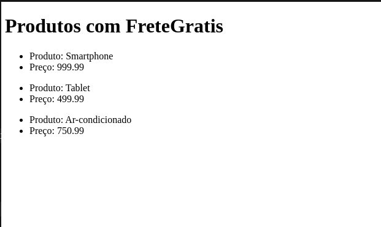

# Método `filter()` 🚀

## O que é o Método `filter()`? 🤔

O método `filter()` ajuda a escolher itens de uma lista no JavaScript. Ele faz uma nova lista só com os itens que passam em um teste. Isso é bom porque não muda a lista original e ajuda a encontrar exatamente o que você precisa, como itens que seguem uma regra específica.

Para tornar nosso entendimento mais claro, vamos relembrar a aula passada sobre o método `map`, que é fundamental para mapear e exibir informações na tela, como os produtos listados em plataformas como **Mercado Livre**, **Amazon** e **Shopee**. O `map` é excelente para renderizar todos os elementos de um array na interface do usuário.

## Mas e Se Quisermos Filtrar Dados? 🤔💡

Imagine que você deseja exibir apenas produtos que oferecem **"FRETE GRÁTIS"**. Como o `map` poderia nos ajudar a selecionar especificamente esses produtos? Embora o `map` seja ótimo para transformar e listar dados, ele não tem a capacidade de **filtrar** elementos baseados em condições específicas. É aqui que o método `filter()` brilha! ✨

## Entendendo o `filter()` na Prática 🎯

O `filter()` entra em cena como uma ferramenta poderosa para selecionar apenas aqueles elementos de um array que atendem a uma condição específica, como produtos com **"FRETE GRÁTIS"**. Diferentemente do `map`, que irá exibir todos os elementos, o `filter()` examina cada item através de uma função teste e cria um novo array apenas com os itens que passam nesse teste.

## Sintaxe do Método `filter()`

A sintaxe básica do `filter()` é simples, mas poderosa:

```javascript
const arrayNumeros = [2, 3, 4, 5, 7, 8, 9, 1, 10, 6];

const novoArray = arrayNumeros.filter((item) => item < 10);

console.log(novoArray); // 2, 3, 4, 5, 7, 8, 9, 1, 6
```

- **Explicação lógica** 🛠️: No exemplo acima, usamos o método `filter` no `arrayNumeros`. Aqui, cada `item`(numero) do array passa por um teste. Se esse `item` atende a uma condição (ser menor que o número 10), ele será guardado no `novoArray`. Se não atender, é deixado de fora. Assim, o `filter` seleciona apenas os números que queremos, baseando-se na condição que definimos. Isso mostra como o `filter` funciona: passa pelos itens, testa cada um, e guardará no `novoArray` apenas os números que passarem no teste. 🎯✨

- **Criação de Novo Array**: Criamos um novo array chamado `novoArray` que irá guardar apenas os elementos que passarem no teste definido pelo `filter()`, no caso o teste foi filtrar todos os números cujo valor forem menor que 10.

- **Preservação do Array Original**: O `filter()` não altera o array original, no caso o `arrayNumeros` permanece da mesma forma que foi criado.

## Utilizando o `filter()` em React 🚀

Vamos imaginar um array de objetos, onde cada objeto representa um produto com propriedades como `nome`, `preco` e `freteGratis`. Ao aplicarmos o `filter()`, podemos facilmente obter um novo array contendo apenas os produtos que têm a propriedade `freteGratis` definida como `true`.

```jsx
import React, { useState } from "react";

export default function App() {
  const [produtos, setProdutos] = useState([
    {
      nome: "Smartphone",
      preco: 999.99,
      freteGratis: true,
    },
    {
      nome: "Notebook",
      preco: 1999.99,
      freteGratis: false,
    },
    {
      nome: "Tablet",
      preco: 499.99,
      freteGratis: true,
    },
    {
      nome: "Smart Tv",
      preco: 1000.0,
      freteGratis: false,
    },
    {
      nome: "Ar-condicionado",
      preco: 750.99,
      freteGratis: true,
    },
  ]);

  const produtosComFreteGratis = produtos.filter((item) => itemfreteGratis === true);

  return (
    <>
      <h1>Produtos com FreteGratis</h1>
      {produtosComFreteGratis.map((item) => (
        <ul>
          <li>Produto: {item.nome}</li>
          <li>Preço: {item.preco}</li>
        </ul>
      ))}
    </>
  );
}
```

### Resultado na tela

Após aplicarmos o filter() e utilizarmos o map() para exibir todos os produtos que ofereciam frete grátis, esse será o resultado.



## Exemplos Práticos Filter() 🌟

### Filtrar por Categoria 🏷️

No exemplo abaixo temos uma lista de produtos categorizados, nele o `filter` pode ser usado para mostrar apenas produtos de uma categoria específica, como "Eletrônicos".

```jsx
import React, { useState } from "react";

function ListaDeProdutos() {
  const [produtos, setProdutos] = useState([
    { id: 1, nome: "Smartphone", categoria: "Eletrônicos" },
    { id: 2, nome: "Notebook", categoria: "Eletrônicos" },
    { id: 3, nome: "Mesa", categoria: "Móveis" },
  ]);

  // Filtra produtos na categoria 'Eletrônicos'
  const produtosEletronicos = produtos.filter(
    (item) => item.categoria === "Eletrônicos"
  );

  return (
    <ul>
      {produtosEletronicos.map((item) => (
        <li>{item.nome}</li>
      ))}
    </ul>
  );
}
```

### Filtrar Palavras com Mais de 5 Letras 🔠

No exemplo abaixo temos um array com uma lista de palavras, e estamos utilizando o  `filter()` para mostrar apenas as palavras que tem a quantidade de letras maiores que 5.

```jsx
import React, { useState } from "react";

function ListaSimples() {

  const [itens, setItens] = useState(["Sol", "Lua", "Estrela", "Céu"]);

  // Filtra itens com menos de 5 letras
  const itensFiltrados = itens.filter((item) => item.length > 5);

  return (
    <ul>
      {itensFiltrados.map((item) => (
        <li>{item}</li>
      ))}
    </ul>
  );
}
```

### Filtrar Números Ímpares de uma Lista 🔢
Use o `filter` para selecionar apenas os números ímpares de um array de números, facilitando a identificação de valores que não são divisíveis por 2.

```jsx

import React, {useState} from 'react';

function NumerosImpares() {
  const [numeros,setNumeros] = useState([1, 2, 3, 4, 5, 6, 7, 8, 9, 10]);

  // Filtrando números ímpares
  const numerosImpares = numeros.filter(numero => numero % 2 !== 0);

  return (
    <div>
      <h2>Números Ímpares</h2>
      <ul>
        {numerosImpares.map((numero) => (
          <li>{numero}</li>
        ))}
      </ul>
    </div>
  );
}

export default NumerosImpares;
```
### Conclusão 🏁

À medida que você pratica, descobrirá o quão fundamental o método filter é tanto no JavaScript quanto no React. Ele não só permite filtrar dados de forma precisa e eficiente, mas também abre caminho para uma experiência de usuário mais interativa e personalizada. Com filter, a capacidade de apresentar apenas o que é relevante torna seus componentes mais robustos e suas aplicações mais elegantes. Assim, explorar e aplicar filter em diferentes cenários é um passo essencial para dominar o desenvolvimento de interfaces dinâmicas. Lembre-se, a prática contínua é o caminho para aperfeiçoar suas habilidades.

🚀 Continue praticando e explorando! Bons códigos e vamos para os exercícios! 📚👨‍💻


[Exercícios - Clique aqui!](./Exercicios/8.FilterExercicios.md)

[Próxima matéria - Clique aqui!](./09.To-Do%20List.md)