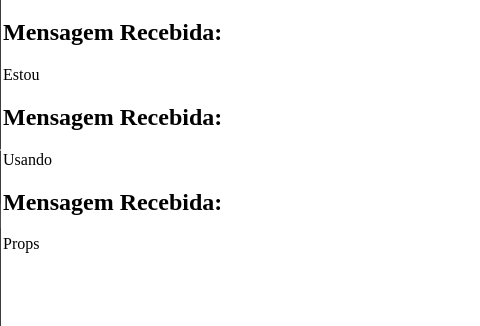
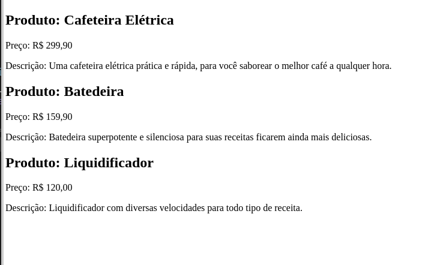

# Props em React 🌐

## 🌟 O que são Props?

**Props**, abreviação de "propriedades", em React são uma forma de **passar dados de um componente pai para um componente filho no React**. Elas atuam em conjunto com a **componentização** e permitem que você forneça diferentes informações para o mesmo componente, tornando-o reutilizável e dinâmico, sem precisar alterar seu código interno.

## 🚀 Para que servem?

- **Reutilização de Componentes:** Props tornam possível usar um único componente em várias situações, ajustando seus valores e dados conforme necessário.
- **Comunicação entre Componentes:** Facilitam a comunicação, permitindo que um componente pai envie informações a um componente filho.
- **Customização e Configuração:** Permite que componentes recebam configurações e se adaptem conforme as necessidades do momento, tornando a customização de elementos como estilos, textos e comportamentos algo simples e direto.

## 🧠 Props na prática!

### Passando Props 🔄

Aqui abaixo criamos um componente chamado `ComponenteComProps` ele será quem iremos componentizar no componente principal `App.js` ou `App.jsx` e passar as props.

```jsx
// Arquivo ComponenteComProps.js

import React from "react";

export default function ComponenteComProps({ mensagem }) {
  return (
    <>
      <h2>Mensagem Recebida:</h2>
      <p>{mensagem}</p>
    </>
  );
}
```

Quando abrimos as chaves entre os parênteses e atribuímos um valor a elas, significa que estamos criando uma prop para esse componente. Observem como a prop `mensagem` é utilizada dentro da tag `<p></p>`. Isso indica que o conteúdo da prop `mensagem` será exibido dentro dessa tag `<p></p>`, permitindo que informações dinâmicas sejam renderizadas na interface do usuário.

Como próximo passo devemos importar o componente `ComponenteComProps` no componente principal `App.jsx / App.jsx`

```jsx
import ComponenteComProps from "./ComponenteComProps";
import React from "react";

export default function App() {
  return (
    <>
      <ComponenteComProps mensagem="Estou" />
      <ComponenteComProps mensagem="Usando" />
      <ComponenteComProps mensagem="Props" />
    </>
  );
}
```



As informações que passamos nas props `mensagem`, (`"Estou"`, `"Usando"`, `"Props"`) agora estão sendo exibidas nas tags `<p></p>`

Essa forma que passamos as props para o componente `<ComponenteComProps/>` passamos da mesma maneira que definimos os atributos em elementos **HTML**.

Dessa forma reaproveitamos um único componente c informações diferentes.

## Outras Formas de se utilizar props 🔄

### Acesso Direto às Props

Em um componente de função, você coloca as `props` diretamente dentro dos parênteses. Exemplo:

```jsx
import React from "react";

export default function ComponenteComProps(props) {
  return (
    <>
      <h1>{props.propriedade}</h1>
    </>
  );
}
```

Agora criamos as props e passamos dentro da tag `<h1></h1>` vamos importar o `<ComponenteComProps/>` no App e passar os valores dessas props.

```jsx
import ComponenteComProps from "./ComponenteComProps";
import React from "react";

export default function App() {
  return (
    <>
      <ComponenteComProps propriedade="Estou" />
      <ComponenteComProps propriedade="Usando" />
      <ComponenteComProps propriedade="Props" />
    </>
  );
}
```

Agora em nossa tela veremos as informações sendo exibidas nas tags `<h1></h1>` dos nossos componentes importados.

;

## Exemplos Práticos de Props 🛠️

### Exemplo 1: Passando Múltiplas Props

Você pode passar várias props para um componente, facilitando a transmissão de diferentes tipos de dados. Por exemplo, um componente `CartaoDeUsuario` pode receber informações de **nome** e **email** dos usuários:

```jsx
import React from "react";

export default function CartaoDeUsuario({ nome, email }) {
  return (
    <>
      <h2>Nome: {nome}</h2>
      <p>Email: {email}</p>
    </>
  );
}
```

Agora vamos importar o componente `<CartaoDeUsuario/>` e passar os valores das props.

```jsx
import React from "react";
import CartaoDeUsuario from "./CartaoDeUsuario";

export default function App() {
  return (
    <>
      <CartaoDeUsuario nome="João Silva" email="JoaoS@exemplo.com" />
      <CartaoDeUsuario nome="Karynne M" email="KarynneM@exemplo.com" />
      <CartaoDeUsuario nome="Joy Assis" email="JoyAssis@exemplo.com" />
    </>
  );
}
```

;

### Exemplo 2: Informações do Produto

Outro exemplo com props, criamos um componente `<InformacoesDoProduto/>` estamos passando o **nome do produto**, **preço** e **descrição**.

```jsx
import React from "react";

export default function InformacoesDoProduto({ nome, preco, descricao }) {
  return (
    <>
      <h2>Produto: {nome}</h2>
      <p>Preço: R$ {preco}</p>
      <p>Descrição: {descricao}</p>
    </>
  );
}
```

```jsx
import React from "react";
import InformacoesDoProduto from "./InformacoesDoProduto";

export default function App() {
  return (
    <>
    <InformacoesDoProduto
      nome="Cafeteira Elétrica"
      preco="299,90"
      descricao="Uma cafeteira elétrica prática e rápida, para você saborear o melhor café a qualquer hora." />

      <InformacoesDoProduto
      nome="Batedeira"
      preco="159,90"
      descricao="Batedeira superpotente e silenciosa para suas receitas ficarem ainda mais deliciosas." />
      
      <InformacoesDoProduto
      nome="Liquidificador"
      preco="120,00"
      descricao="Liquidificador com diversas velocidades para todo tipo de receita." />
    </>
  );
}
```




### Conclusão 🏁

Praticando, você verá como as **props** são fundamentais no React para criar componentes dinâmicos e reutilizáveis. Elas tornam a comunicação entre componentes clara e eficiente, essencial para desenvolver aplicações complexas com simplicidade. Dominar o uso das **props** abre caminho para interfaces interativas e customizáveis. Lembre-se, a chave para o domínio é a prática constante.

🚀 Continue praticando! Bons códigos e vamos para os exercícios! 📚👨‍💻

[Exercícios - Clique aqui!](./Exercicios/10.PropsExercicios.md)

[Próxima matéria - Clique aqui!](./11.useEffect.md)

